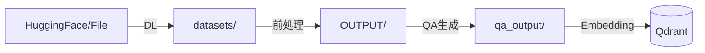

# Gemini3-RAG 統合ツール 操作マニュアル

本ドキュメントでは、Gemini 3 (2.0 Flash) 世代に対応した RAG Q&A生成・Qdrant管理統合ツール（`rag_qa_pair_qdrant.py`）の操作方法を解説します。

**最終更新**: 2025-12-03 (Gemini 2.0 Flash / Embedding 001 対応版)

## 目次

- [1. はじめに](#1-はじめに)
  - [1.1 概要](#11-概要)
  - [1.2 動作要件](#12-動作要件)
  - [1.3 起動手順](#13-起動手順)
- [2. UI構成と共通操作](#2-ui構成と共通操作)
  - [2.1 サイドバーメニュー](#21-サイドバーメニュー)
  - [2.2 データフロー](#22-データフロー)
- [3. 機能詳細](#3-機能詳細)
  - [3.1 📖 説明 (System Explanation)](#31--説明-system-explanation)
  - [3.2 📥 RAGデータダウンロード](#32--ragデータダウンロード)
  - [3.3 🤖 Q/A生成 (QA Generation)](#33--qa生成-qa-generation)
  - [3.4 🗄️ Qdrant登録 (Qdrant Registration)](#34-️-qdrant登録-qdrant-registration)
  - [3.5 🔍 Show-Qdrant (Visualization)](#35--show-qdrant-visualization)
  - [3.6 🔎 Qdrant検索 (Semantic Search)](#36--qdrant検索-semantic-search)
- [4. トラブルシューティング](#4-トラブルシューティング)
- [5. 付録](#5-付録)

---

## 1. はじめに

### 1.1 概要

本アプリケーションは、最新の **Google Gemini API** を活用したRAG（Retrieval-Augmented Generation）システムの構築・運用・検証を行うための統合GUIツールです。

**主な特徴:**
*   **Gemini 2.0 Flash**: 高速・安価なLLMを用いたQ/A生成とAI応答。
*   **Gemini Embedding 001**: 3072次元の高精度ベクトルを用いた検索。
*   **Celery並列処理**: 大規模データセットの高速処理（レート制限対応）。
*   **Qdrant管理**: ベクトルDBの登録、可視化、検索をGUIで完結。

### 1.2 動作要件

*   **Python**: 3.10+
*   **API Key**: Google Gemini API Key (`GEMINI_API_KEY` in `.env`)
*   **Middleware**:
    *   Qdrant (Port: 6333)
    *   Redis (Port: 6379) - 並列処理用

> 環境構築の詳細は [doc/01_install.md](01_install.md) を参照してください。

### 1.3 起動手順

**1. ミドルウェアの起動**
```bash
docker compose -f docker-compose/docker-compose.yml up -d
```

**2. Celeryワーカーの起動 (Q/A生成を行う場合)**
```bash
# Gemini APIのレート制限に合わせてワーカー数を調整 (推奨: 8)
redis-cli FLUSHDB && ./start_celery.sh restart -w 8
```

**3. アプリケーションの起動**
```bash
streamlit run rag_qa_pair_qdrant.py --server.port=8500
```
ブラウザで `http://localhost:8500` にアクセスします。

---

## 2. UI構成と共通操作

### 2.1 サイドバーメニュー

画面左側のサイドバーで機能を切り替えます。

| メニュー項目 | 概要 | 関連ドキュメント |
| :--- | :--- | :--- |
| **📖 説明** | システム全体像、ディレクトリ構造の確認 | - |
| **📥 RAGデータダウンロード** | HuggingFace/ローカルからのデータ取得・前処理 | [helper_rag.md](helper_rag.md) |
| **🤖 Q/A生成** | GeminiによるQ/Aペア生成 (並列処理対応) | [05_qa_pair.md](05_qa_pair.md) |
| **🗄️ Qdrant登録** | Q/Aペアのベクトル化・DB登録 | [06_embedding_qdrant.md](06_embedding_qdrant.md) |
| **🔍 Show-Qdrant** | コレクション統計・データ閲覧 | - |
| **🔎 Qdrant検索** | RAG検索精度の検証・AI応答生成 | [07_qdrant_integration_add.md](07_qdrant_integration_add.md) |

### 2.2 データフロー

本ツールは以下のディレクトリ構造に基づいてデータを処理します。



---

## 3. 機能詳細

### 3.1 📖 説明 (System Explanation)

システムの概要、現在のディレクトリ構造、主要なCLIコマンドの早見表を表示します。
初めて利用する場合や、データフローを確認したい場合に参照します。

### 3.2 📥 RAGデータダウンロード

RAGの元となるドキュメントを取得し、クリーニングを行います。

**操作ステップ:**
1.  **サイドバー**: データソースを選択（Wikipedia, CC-News, Livedoor, ローカルファイル）。
2.  **設定**: 取得件数や最小文字数を設定。
3.  **実行**: 「🚀 ダウンロード＆前処理開始」をクリック。
4.  **確認**: `OUTPUT/` フォルダに `preprocessed_*.csv` が生成されます。

### 3.3 🤖 Q/A生成 (QA Generation)

> 詳細は [doc/05_qa_pair.md](05_qa_pair.md) を参照

ドキュメントから「質問」と「回答」のペアを自動生成します。

**操作ステップ:**
1.  **入力ソース**: `OUTPUT/` 内の前処理済みデータを選択。
2.  **並列処理設定**:
    *   **Celery並列処理**: `ON` (推奨)
    *   **ワーカー数**: 8 (Gemini APIのレート制限に応じて調整)
3.  **モデル設定**:
    *   **モデル**: `gemini-2.0-flash` (デフォルト・推奨)
    *   **トークン数**: チャンク統合の範囲設定（Min 150 - Max 400程度）
4.  **実行**: 「🚀 Q/A生成開始」をクリック。
5.  **出力**: `qa_output/` に `a02_qa_pairs_*.csv` が生成されます。

### 3.4 🗄️ Qdrant登録 (Qdrant Registration)

> 詳細は [doc/06_embedding_qdrant.md](06_embedding_qdrant.md) を参照

生成されたQ/Aペアをベクトル化し、Qdrantに登録します。

**重要な仕様:**
*   **Embeddingモデル**: `gemini-embedding-001`
*   **次元数**: **3072次元** (高精度設定)

**操作ステップ (個別CSV登録):**
1.  **モード**: 「📄 個別CSV操作」を選択。
2.  **ファイル**: `qa_output/` 内のCSVを選択。
3.  **設定**:
    *   **コレクション名**: 自動設定 (例: `qa_cc_news_a02_llm`)
    *   **answerを含める**: `ON` (回答内容も検索対象にする場合)
4.  **実行**: 「🚀 Qdrantに登録」をクリック。

**操作ステップ (コレクション統合):**
複数のコレクションを1つにマージする場合に使用します。「📊 全コレクション操作」から実行可能です。

### 3.5 🔍 Show-Qdrant (Visualization)

Qdrant内のデータを可視化します。

**機能:**
*   **接続チェック**: Qdrantサーバーへの接続確認。
*   **コレクション一覧**: ポイント数、ステータスの確認。
*   **データ詳細**: 登録されたベクトルデータのペイロード（質問・回答テキスト）の閲覧。
*   **データソース分析**: どのファイルから生成されたデータかの内訳表示。

### 3.6 🔎 Qdrant検索 (Semantic Search)

> 詳細は [doc/07_qdrant_integration_add.md](07_qdrant_integration_add.md) を参照

構築したRAGシステムの検索精度を確認します。

**操作ステップ:**
1.  **コレクション**: 検索対象を選択。
2.  **クエリ**: 質問文を入力 (例: "Geminiの特徴は？")。
3.  **検索**: 「🔍 検索実行」をクリック。
4.  **結果**:
    *   **類似Q/A**: ベクトル検索でヒットしたTop-K件を表示。スコアを確認。
    *   **AI応答**: 検索結果をコンテキストとして `gemini-2.0-flash` が生成した回答を表示。

---

## 4. トラブルシューティング

### Q: Qdrantに接続できない
*   Dockerコンテナが起動しているか確認してください (`docker compose ps`)。
*   ポート `6333` が競合していないか確認してください。

### Q: Q/A生成が進まない / タイムアウトする
*   Celeryワーカーが起動しているか確認してください (`./start_celery.sh status`)。
*   Redisのキューが詰まっている可能性があります。一度クリアしてください (`redis-cli FLUSHDB`)。
*   Gemini APIのレート制限（429エラー）の可能性があります。ワーカー数を減らしてください。

### Q: 検索結果の精度が低い
*   Qdrant登録時に `gemini-embedding-001` (3072次元) が使用されたか確認してください。
*   元ドキュメントのチャンクサイズが適切か (`doc/03_chunk.md`参照)、設定を見直してください。

---

## 5. 付録

### ディレクトリ構成

```text
.
├── datasets/                 # ダウンロードデータ
├── OUTPUT/                   # 前処理済みデータ
├── qa_output/                # 生成Q/Aペア
├── docker-compose/           # Docker設定
├── rag_qa_pair_qdrant.py     # アプリケーション本体
├── helper_*.py               # 各種ヘルパーモジュール
└── doc/                      # ドキュメント群
```

### コマンドリファレンス

| 目的 | コマンド |
| :--- | :--- |
| **アプリ起動** | `streamlit run rag_qa_pair_qdrant.py --server.port=8500` |
| **ワーカー再起動** | `./start_celery.sh restart -w 8` |
| **DB起動** | `docker compose -f docker-compose/docker-compose.yml up -d` |
| **CLI Q/A生成** | `python a02_make_qa_para.py --dataset cc_news --use-celery` |
