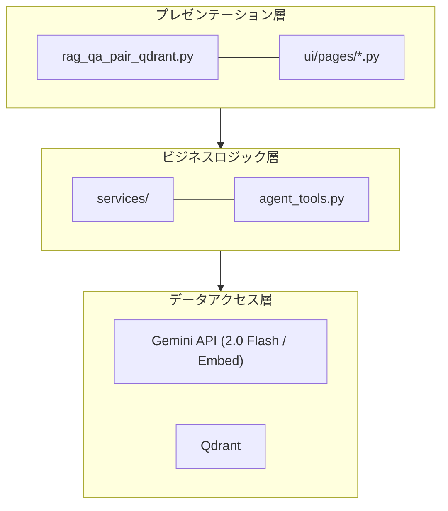
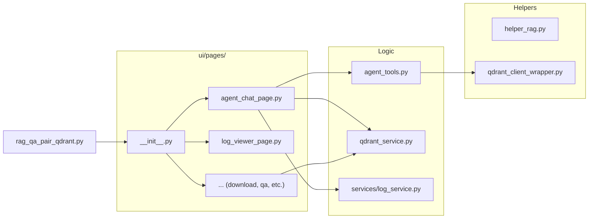
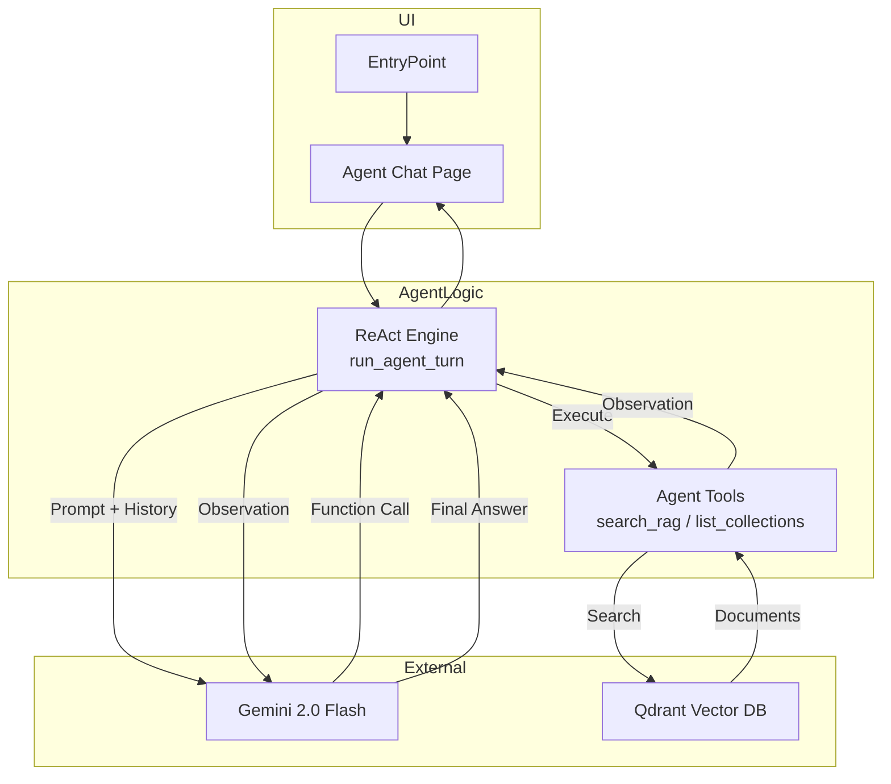
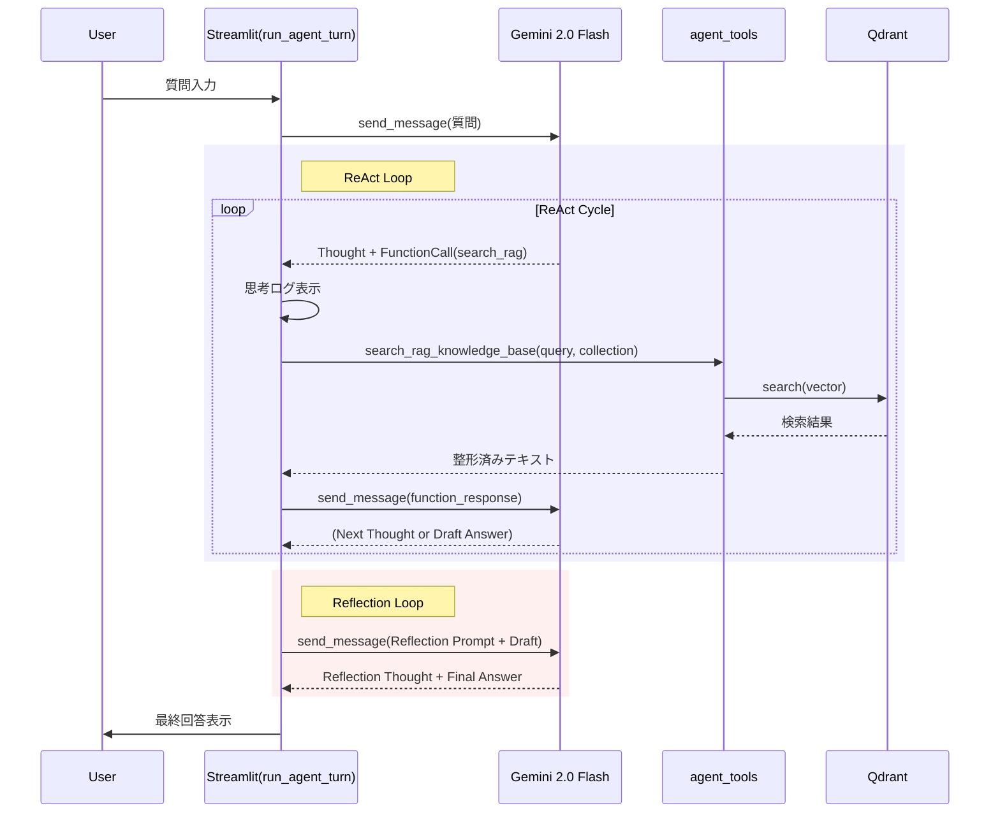

# rag_qa_pair_qdrant.py 詳細設計書

作成日: 2025-11-27
更新日: 2025-12-08 (Gemini ReAct Agent対応)

## 目次

1. [概要](#1-概要)
   - 1.1 [本モジュールの目的](#11-本モジュールの目的)
   - 1.2 [主な機能（7画面の概要）](#12-主な機能7画面の概要)
   - 1.3 [対応データセット](#13-対応データセット)
2. [アーキテクチャ](#2-アーキテクチャ)
   - 2.1 [システム構成図（3層アーキテクチャ）](#21-システム構成図3層アーキテクチャ)
   - 2.2 [モジュール依存関係図](#22-モジュール依存関係図)
   - 2.3 [レイヤー別役割分担表](#23-レイヤー別役割分担表)
   - 2.4 [システムアーキテクチャ図（Mermaid）](#24-システムアーキテクチャ図mermaid)
   - 2.5 [コンポーネント連携シーケンス図](#25-コンポーネント連携シーケンス図)
3. [データフロー](#3-データフロー)
   - 3.1 [エンドツーエンド処理フロー図](#31-エンドツーエンド処理フロー図)
   - 3.2 [各ステップの入出力](#32-各ステップの入出力)
   - 3.3 [ディレクトリ構造](#33-ディレクトリ構造)
4. [サービス層 & ツール層](#4-サービス層--ツール層)
   - 4.1 [dataset_service.py - データセット操作](#41-dataset_servicepy---データセット操作)
   - 4.2 [qdrant_service.py - Qdrant操作](#42-qdrant_servicepy---qdrant操作)
   - 4.3 [file_service.py - ファイル操作](#43-file_servicepy---ファイル操作)
   - 4.4 [qa_service.py - Q/A生成](#44-qa_servicepy---qa生成)
   - 4.5 [agent_tools.py - エージェント用ツール](#45-agent_toolspy---エージェント用ツール)
5. [UI層 (ui/pages/)](#5-ui層-uipages)
   - 5.1 [画面一覧と遷移](#51-画面一覧と遷移)
   - 5.2 [各ページの機能詳細](#52-各ページの機能詳細)
6. [メニュー単位の処理概要・処理方式](#6-メニュー単位の処理概要処理方式)
   - 6.1 [📖 説明](#61--説明)
   - 6.2 [🤖 エージェント対話](#62--エージェント対話)
   - 6.3 [📊 未回答ログ](#63--未回答ログ)
   - 6.4 [📥 RAGデータダウンロード](#64--ragデータダウンロード)
   - 6.5 [🤖 Q/A生成](#65--qa生成)
   - 6.6 [📥 CSVデータ登録](#66--csvデータ登録)
   - 6.7 [🗄️ Qdrantデータ管理](#67--qdrantデータ管理)
   - 6.8 [🔎 Qdrant検索](#68--qdrant検索)
7. [設定・依存関係](#7-設定依存関係)
   - 7.1 [必須環境変数](#71-必須環境変数)
   - 7.2 [依存サービス](#72-依存サービス)
   - 7.3 [主要な定数・設定値](#73-主要な定数設定値)
8. [使用方法](#8-使用方法)
   - 8.1 [起動手順](#81-起動手順)
   - 8.2 [典型的なワークフロー](#82-典型的なワークフロー)
9. [ReAct エージェント詳細設計](#9-react-エージェント詳細設計)
   - 9.1 [ReAct ループの仕組み](#91-react-ループの仕組み)
   - 9.2 [主要クラス・関数 IPO 定義](#92-主要クラス関数-ipo-定義)
   - 9.3 [システムプロンプト設計](#93-システムプロンプト設計)
   - 9.4 [シーケンス図 (Agent Turn)](#94-シーケンス図-agent-turn)

---

## 1. 概要

### 1.1 本モジュールの目的

`rag_qa_pair_qdrant.py` は、**Gemini 3 (2.0 Flash)** 世代に対応したRAG（Retrieval-Augmented Generation）システムの統合管理ツールです。

**一言で言うと**: Gemini活用型RAG Q&A生成・Qdrant管理、および **ReAct型エージェント** による対話を実現する統合Streamlitアプリケーション

**役割**:
- データ取得からベクトル検索までの **RAGパイプライン全体** を管理
- **ReActエージェント** を介した、ツール利用による高度な対話機能
- **Gemini API** (`gemini-2.0-flash`, `gemini-embedding-001`) を全面的に採用し、高速・低コスト・高精度を実現

| 項目 | 内容 |
|------|------|
| ファイル名 | rag_qa_pair_qdrant.py |
| フレームワーク | Streamlit |
| 起動コマンド | `streamlit run rag_qa_pair_qdrant.py --server.port=8500` |

### 1.2 主な機能（7画面の概要）

| 画面 | アイコン | 機能概要 |
|------|---------|---------|
| 説明 | 📖 | システムのデータフロー・ディレクトリ構造を表示 |
| エージェント対話 | 🤖 | **ReAct Agent** (Gemini 2.0) との対話。ナレッジベース検索 + **Reflection (自己推敲)** による高品質な回答。 |
| 未回答ログ | 📊 | エージェントが回答できなかった質問のログ分析 |
| RAGデータDL | 📥 | HuggingFace/ローカルファイルからデータ取得・前処理 |
| Q/A生成 | 🤖 | **Gemini 2.0 Flash** によるQ&Aペア自動生成（Celery並列処理対応） |
| CSVデータ登録 | 📥 | **Gemini Embedding (3072次元)** でベクトル化・登録・コレクション統合 |
| Qdrantデータ管理 | 🗄️ | Qdrantコレクション内容の閲覧 (Show-Qdrant) |
| Qdrant検索 | 🔎 | セマンティック検索単体のテスト・AI応答生成 |

### 1.3 対応データセット

| データセット | 識別子 | 説明 |
|-------------|--------|------|
| Wikipedia日本語 | `wikipedia_ja` | Wikipedia日本語版 |
| CC-News | `cc_news` | CC-News英語ニュース |
| Livedoor | `livedoor` | Livedoorニュースコーパス |
| カスタム | `custom_upload` | ローカルファイル（CSV/TXT/JSON/JSONL） |

---

## 2. アーキテクチャ

### 2.1 システム構成図（3層アーキテクチャ）

### 2.2 モジュール依存関係図

### 2.3 レイヤー別役割分担表

| レイヤー | モジュール | 責務 |
|---------|-----------|------|
| **エントリポイント** | `rag_qa_pair_qdrant.py` | アプリ起動、ルーティング |
| **UI層** | `ui/pages/agent_chat_page.py` | エージェント対話UI、ReActループ制御 (`run_agent_turn`) |
| **ツール層** | `agent_tools.py` | エージェントが利用するツール群 (`search_rag_knowledge_base`) |
| **サービス層** | `services/*.py` | データ処理、DB操作の抽象化 |

### 2.4 システムアーキテクチャ図（Mermaid）

---

## 3. データフロー

(基本構成は既存と同様。RAGデータ生成パイプラインは変更なし)

### 3.1 エンドツーエンド処理フロー図
1. データDL -> 2. 前処理 -> 3. QA生成 -> 4. 埋め込み登録 -> **5. エージェントによる活用 (Search & Answer)**

---

## 4. サービス層 & ツール層

### 4.5 agent_tools.py - エージェント用ツール

**責務**: エージェントが外部環境（Qdrant）と対話するためのインターフェースを提供。

| 関数名 | 説明 | 関連ツール名（LLM側） |
|--------|------|-------------------|
| `search_rag_knowledge_base` | 指定されたコレクションからクエリに関連する情報を検索する。ベクトル検索を実行。 | `search_rag_knowledge_base` |
| `list_rag_collections` | 利用可能なQdrantコレクションの一覧を返す。 | `list_rag_collections` |

---

## 5. UI層 (ui/pages/)

### 5.1 画面一覧と遷移
サイドバーのラジオボタンにより、以下の画面を切り替え。

1. **説明 (`explanation`)**
2. **エージェント対話 (`agent_chat`)**
3. **未回答ログ (`log_viewer`)**
4. **RAGデータDL (`rag_download`)**
5. **Q/A生成 (`qa_generation`)**
6. **CSVデータ登録 (`qdrant_registration`)**
7. **Qdrantデータ管理 (`show_qdrant`)**
8. **Qdrant検索 (`qdrant_search`)**

### 5.2 各ページの機能詳細

#### `agent_chat_page.py` (エージェント対話)
*   **機能**: Gemini 2.0 Flash を用いたチャットインターフェース。
*   **特徴**:
    *   **ReActループ**: 思考(Thought)と行動(Action)の可視化。
    *   **Reflection**: 回答案生成後に自己評価・修正を行い、ハルシネーションの低減とスタイル統一を実現。
    *   **マルチコレクション**: 検索対象のコレクションをサイドバーで選択可能。
    *   **ストリーミング**: 思考プロセスを `st.expander` 内に逐次表示。

#### `log_viewer_page.py` (未回答ログ)
*   **機能**: エージェントが「回答なし」と判断したクエリの履歴を表示・分析。

---

## 6. メニュー単位の処理概要・処理方式

### 6.1 📖 説明
システム全体の概要を表示。

### 6.2 🤖 エージェント対話
ReActエージェントがユーザーの質問に対し、ツール（検索）を使って回答を作成します。
*   **思考の可視化**: 「なぜその検索を行うか」という推論過程を表示。
*   **ツール利用**: `search_rag_knowledge_base` を自律的に呼び出し、Qdrantから情報を取得。
*   **Reflection (推敲)**: 回答案を作成した後、自己評価フェーズを実行。正確性・適切性・スタイルを推敲し、より洗練された回答を提示します。

---

## 9. ReAct + Reflection エージェント詳細設計

本システムの中核である「ハイブリッド・ナレッジ・エージェント」の詳細設計です。
参考: `doc/11_agent_react.md`

### 9.1 ReAct + Reflection の仕組み

Gemini 2.0 Flash の Function Calling 機能を利用し、以下のサイクルを回します。

1.  **ReAct フェーズ (解決)**:
    *   **Thought (思考)**: ユーザーの入力に対し、外部知識が必要か、どのツールを使うべきか考える。
    *   **Action (行動)**: ツール (`search_rag_knowledge_base`) を呼び出すことを決定し、APIにリクエスト。
    *   **Observation (観察)**: ツールを実行し、その結果（検索結果やエラー）を取得。
    *   **Draft Answer (ドラフト作成)**: 観察結果に基づき、回答案を生成。

2.  **Reflection フェーズ (推敲)**:
    *   **Critique (批評)**: 生成されたドラフト回答に対し、検索結果（コンテキスト）との整合性やスタイルを自己評価。
    *   **Revise (修正)**: 必要に応じて回答を修正し、最終回答 (Final Answer) とする。

### 9.2 主要クラス・関数 IPO 定義

#### `ui.pages.agent_chat_page.run_agent_turn`

エージェントの1ターン（ユーザー発話〜最終回答）を制御するメイン関数。

| 項目 | 内容 |
|------|------|
| **Input** | `chat_session`: Gemini ChatSession `user_input`: ユーザーの質問文字列 |
| **Process** | 1. `chat_session.send_message(user_input)` を送信。 2. 応答に `function_call` が含まれるか確認。 3. **含まれる場合**: 　a. 思考プロセスを表示・ログ記録。 　b. `agent_tools` 内の対応関数を実行。 　c. 結果を `function_response` として Gemini に返送。 　d. ステップ2に戻る（ReActループ）。 4. **含まれない場合**: 　a. 現在の回答をドラフト (Draft Answer) とする。 5. **Reflection (推敲)**: 　a. ドラフト回答を `REFLECTION_INSTRUCTION` と共に送信。 　b. 自己評価結果に基づき、最終回答 (Final Answer) を抽出。 |
| **Output** | `final_response_text`: 最終的な回答文字列 |

#### `agent_tools.search_rag_knowledge_base`

RAG検索を実行するツール関数。

| 項目 | 内容 |
|------|------|
| **Input** | `query`: 検索クエリ `collection_name`: 検索対象コレクション名 (Optional) |
| **Process** | 1. Qdrantヘルスチェック。 2. `collection_name` の存在確認。 3. `embed_query` でクエリをベクトル化 (Gemini Embedding)。 4. `search_collection` でベクトル検索。 5. スコア閾値 (`AgentConfig.RAG_SCORE_THRESHOLD`) でフィルタリング。 6. 検索結果を LLM が理解しやすいテキスト形式に整形。 |
| **Output** | 整形された検索結果文字列 (または `[[NO_RAG_RESULT]]`) |

### 9.3 システムプロンプト設計

**System Instruction:**
1.  **役割定義**: 社内ドキュメント検索システムと連携したエージェント。
2.  **思考プロセス指示**: "Thought: ..." 形式で思考を出力することを強制。
3.  **Router Guidelines (行動指針)**: 専門知識の検索、コレクション選択、正直さの重視。

**Reflection Instruction:**
ドラフト回答に対し、以下の観点でチェック・修正を促すプロンプト。
1.  **正確性**: 検索結果に基づいているか、捏造がないか。
2.  **回答の適切性**: ユーザーの質問に答えているか。
3.  **スタイル**: 丁寧な日本語か。

### 9.4 シーケンス図 (Agent Turn)

---