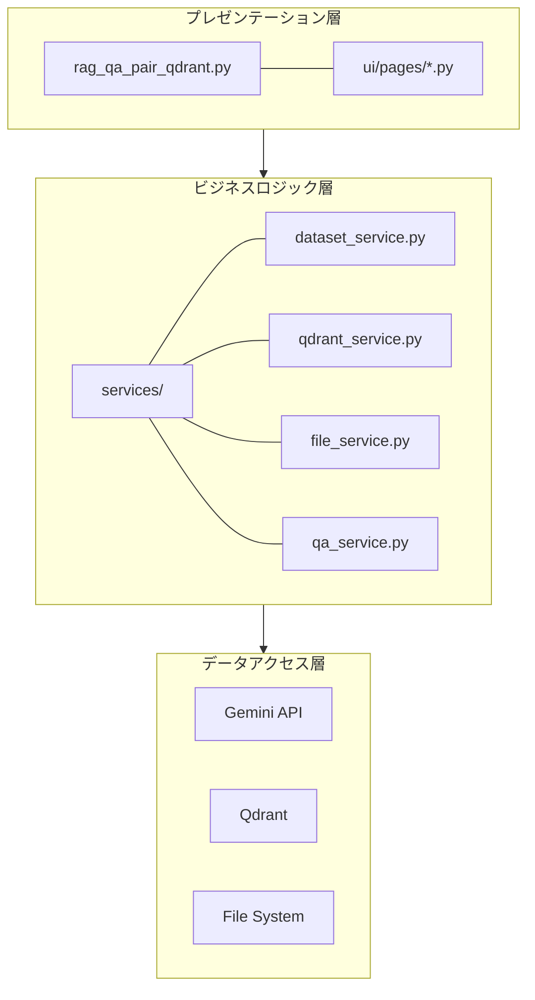
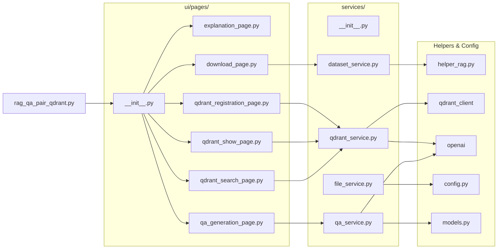
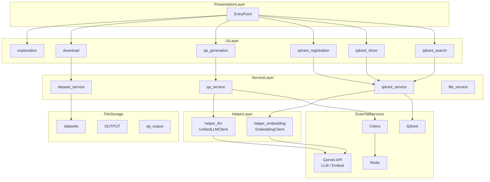
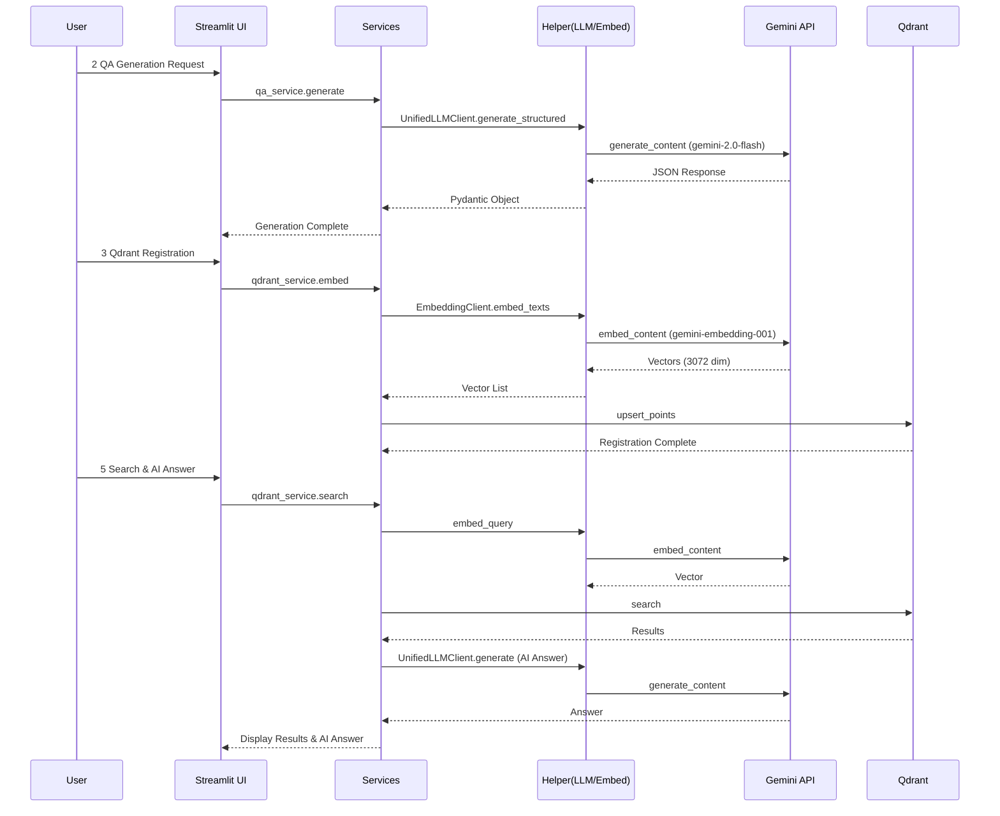
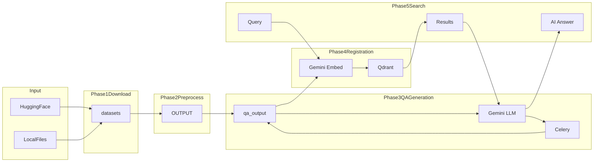
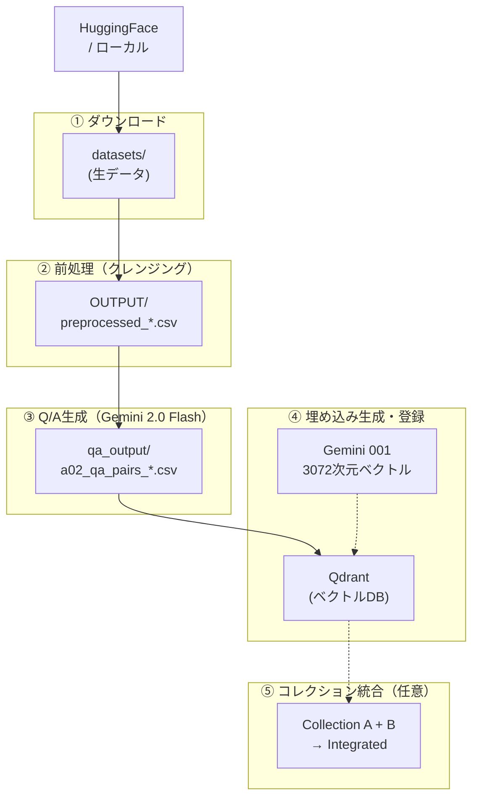
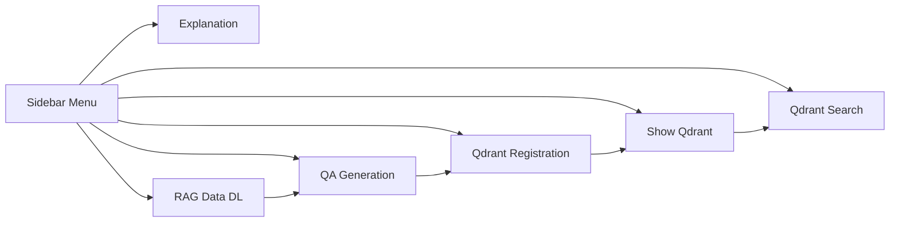

# rag_qa_pair_qdrant.py ドキュメント

作成日: 2025-11-27
更新日: 2025-12-03 (Gemini移行対応)

## 目次

1. [概要](#1-概要)
   - 1.1 [本モジュールの目的](#11-本モジュールの目的)
   - 1.2 [主な機能（6画面の概要）](#12-主な機能6画面の概要)
   - 1.3 [対応データセット](#13-対応データセット)
2. [アーキテクチャ](#2-アーキテクチャ)
   - 2.1 [システム構成図（3層アーキテクチャ）](#21-システム構成図3層アーキテクチャ)
   - 2.2 [モジュール依存関係図](#22-モジュール依存関係図)
   - 2.3 [レイヤー別役割分担表](#23-レイヤー別役割分担表)
   - 2.4 [システムアーキテクチャ図（Mermaid）](#24-システムアーキテクチャ図mermaid)
   - 2.5 [コンポーネント連携シーケンス図](#25-コンポーネント連携シーケンス図)
   - 2.6 [データフロー図（Mermaid）](#26-データフロー図mermaid)
3. [データフロー](#3-データフロー)
   - 3.1 [エンドツーエンド処理フロー図](#31-エンドツーエンド処理フロー図)
   - 3.2 [各ステップの入出力](#32-各ステップの入出力)
   - 3.3 [ディレクトリ構造](#33-ディレクトリ構造)
4. [サービス層 (services/)](#4-サービス層-services)
   - 4.1 [dataset_service.py - データセット操作](#41-dataset_servicepy---データセット操作)
   - 4.2 [qdrant_service.py - Qdrant操作](#42-qdrant_servicepy---qdrant操作)
   - 4.3 [file_service.py - ファイル操作](#43-file_servicepy---ファイル操作)
   - 4.4 [qa_service.py - Q/A生成](#44-qa_servicepy---qa生成)
5. [UI層 (ui/pages/)](#5-ui層-uipages)
   - 5.1 [画面一覧と遷移](#51-画面一覧と遷移)
   - 5.2 [各ページの機能詳細](#52-各ページの機能詳細)
6. [メニュー単位の処理概要・処理方式](#6-メニュー単位の処理概要処理方式)
   - 6.1 [📖 説明](#61--説明)
   - 6.2 [📥 RAGデータダウンロード](#62--ragデータダウンロード)
   - 6.3 [🤖 Q/A生成](#63--qa生成)
   - 6.4 [🗄️ Qdrant登録](#64--qdrant登録)
   - 6.5 [🔍 Show-Qdrant](#65--show-qdrant)
   - 6.6 [🔎 Qdrant検索](#66--qdrant検索)
7. [設定・依存関係](#7-設定依存関係)
   - 7.1 [必須環境変数](#71-必須環境変数)
   - 7.2 [依存サービス](#72-依存サービス)
   - 7.3 [主要な定数・設定値](#73-主要な定数設定値)
8. [使用方法](#8-使用方法)
   - 8.1 [起動手順](#81-起動手順)
   - 8.2 [典型的なワークフロー](#82-典型的なワークフロー)
   - 8.3 [トラブルシューティング](#83-トラブルシューティング)

---

## 1. 概要

### 1.1 本モジュールの目的

`rag_qa_pair_qdrant.py` は、**Gemini 3 (2.0 Flash)** 世代に対応したRAG（Retrieval-Augmented Generation）システムの統合管理ツールです。

**一言で言うと**: Gemini活用型RAG Q&A生成・Qdrant管理の統合Streamlitアプリケーション

**役割**:
- データ取得からベクトル検索までの **RAGパイプライン全体** を管理
- **6つの画面** で構成されるWebインターフェース
- **Gemini API** (`gemini-2.0-flash`, `gemini-embedding-001`) を全面的に採用し、高速・低コスト・高精度を実現

| 項目 | 内容 |
|------|------|
| ファイル名 | rag_qa_pair_qdrant.py |
| 行数 | 142行（エントリポイントのみ） |
| フレームワーク | Streamlit |
| 起動コマンド | `streamlit run rag_qa_pair_qdrant.py --server.port=8500` |

### 1.2 主な機能（6画面の概要）

| 画面 | アイコン | 機能概要 |
|------|---------|---------|
| 説明 | 📖 | システムのデータフロー・ディレクトリ構造を表示 |
| RAGデータDL | 📥 | HuggingFace/ローカルファイルからデータ取得・前処理 |
| Q/A生成 | 🤖 | **Gemini 2.0 Flash** によるQ&Aペア自動生成（Celery並列処理対応） |
| Qdrant登録 | 🗄️ | **Gemini Embedding (3072次元)** でベクトル化・登録・コレクション統合 |
| Show-Qdrant | 🔍 | Qdrantコレクション内容の閲覧 |
| Qdrant検索 | 🔎 | セマンティック検索・**AI応答生成 (RAG)** |

### 1.3 対応データセット

| データセット | 識別子 | 説明 | 件数目安 |
|-------------|--------|------|---------|
| Wikipedia日本語 | `wikipedia_ja` | Wikipedia日本語版 | 大規模 |
| CC100日本語 | `japanese_text` | CC100日本語（Webテキスト） | 大規模 |
| CC-News | `cc_news` | CC-News英語ニュース | 大規模 |
| Livedoor | `livedoor` | Livedoorニュースコーパス（9カテゴリ） | 7,376件 |
| カスタム | `custom_upload` | ローカルファイル（CSV/TXT/JSON/JSONL） | 任意 |

---

## 2. アーキテクチャ

### 2.1 システム構成図（3層アーキテクチャ）
・3層図



### 2.2 モジュール依存関係図



### 2.3 レイヤー別役割分担表

| レイヤー | モジュール | 責務 |
|---------|-----------|------|
| **エントリポイント** | `rag_qa_pair_qdrant.py` | Streamlitアプリ起動、画面ルーティング |
| **UI層** | `ui/pages/*.py` | ユーザーインターフェース、入力検証、表示制御 |
| **サービス層** | `services/*.py` | ビジネスロジック、API抽象化、データ変換 |
| **ヘルパー層** | `helper_*.py` | `UnifiedLLMClient`, `EmbeddingClient` 等のコア機能 |
| **モデル層** | `models.py` | データ構造定義（Pydantic） |

### 2.4 システムアーキテクチャ図（Mermaid）



### 2.5 コンポーネント連携シーケンス図



### 2.6 データフロー図（Mermaid）



---

## 3. データフロー

### 3.1 エンドツーエンド処理フロー図



### 3.2 各ステップの入出力

| ステップ | 処理内容 | 入力 | 出力 | 担当サービス |
|---------|---------|------|------|-------------|
| ① | ダウンロード | HuggingFace URL | `datasets/*.csv` | `dataset_service` |
| ② | 前処理 | `datasets/*.csv` | `OUTPUT/preprocessed_*.csv` | `dataset_service`, `file_service` |
| ③ | Q/A生成 | `OUTPUT/preprocessed_*.csv` | `qa_output/a02_qa_pairs_*.csv` | `qa_service` |
| ④ | ベクトル登録 | `qa_output/*.csv` | Qdrantコレクション | `qdrant_service` |
| ⑤ | コレクション統合 | 複数Qdrantコレクション | 統合コレクション | `qdrant_service` |

### 3.3 ディレクトリ構造

```
gemini3_rag_qa/
├── rag_qa_pair_qdrant.py     # メインエントリポイント
│
├── services/                  # ビジネスロジック層
│   ├── __init__.py
│   ├── dataset_service.py    # データセット操作
│   ├── qdrant_service.py     # Qdrant操作・コレクション統合
│   ├── file_service.py       # ファイル操作
│   └── qa_service.py         # Q/A生成
│
├── ui/pages/                  # UI層
│   ├── __init__.py
│   ├── explanation_page.py
│   ├── download_page.py
│   ├── qa_generation_page.py
│   ├── qdrant_registration_page.py
│   ├── qdrant_show_page.py
│   └── qdrant_search_page.py
│
├── datasets/                  # ①生データ
├── OUTPUT/                    # ②前処理済みデータ
└── qa_output/                 # ③生成Q/Aペア
```

---

## 4. サービス層 (services/)

### 4.1 dataset_service.py - データセット操作

**責務**: データセットのダウンロード、読み込み、前処理

### 4.2 qdrant_service.py - Qdrant操作

**責務**: Qdrant操作、Embedding生成 (`helper_embedding.py`利用)、コレクション統合

**Gemini対応**:
- `embed_texts_for_qdrant`: `create_embedding_client(provider="gemini")` を呼び出し、3072次元のベクトルを生成。

### 4.3 file_service.py - ファイル操作

**責務**: ファイルの読み込み、保存、履歴管理

### 4.4 qa_service.py - Q/A生成

**責務**: Q/Aペアの生成と保存

**Gemini対応**:
- `run_advanced_qa_generation`: `a02_make_qa_para.py` を呼び出し、`gemini-2.0-flash` モデルでQ/A生成を実行。

---

## 5. UI層 (ui/pages/)

### 5.1 画面一覧と遷移



### 5.2 各ページの機能詳細

| ページ | ファイル | 主要機能 |
|--------|---------|---------|
| 説明 | `explanation_page.py` | データフロー図表示、ディレクトリ構造説明、コマンド早見表 |
| RAGデータDL | `download_page.py` | データセット選択、ダウンロード、前処理、保存 |
| Q/A生成 | `qa_generation_page.py` | Geminiモデル選択、並列処理、進捗表示 |
| Qdrant登録 | `qdrant_registration_page.py` | 全コレクション操作/個別CSV操作/コレクション統合 |
| Show-Qdrant | `qdrant_show_page.py` | コレクション一覧、詳細表示、データ閲覧 |
| Qdrant検索 | `qdrant_search_page.py` | 検索クエリ入力、AI応答生成 |

---

## 6. メニュー単位の処理概要・処理方式

### 6.1 📖 説明
システム全体の概要を表示。

### 6.2 📥 RAGデータダウンロード
HuggingFaceやローカルファイルからデータを取得・前処理。

### 6.3 🤖 Q/A生成
**Gemini 2.0 Flash** を使用して高速にQ/Aペアを生成。Celeryによる並列処理もサポート。

#### 主要パラメータ
| パラメータ | 説明 | 推奨値 |
|-----------|------|-------------|
| `model` | 使用モデル | **gemini-2.0-flash** |
| `celery_workers` | Celeryワーカー数 | **8** (Gemini APIレート制限考慮) |
| `max_docs` | 処理する最大ドキュメント数 | 100 |

### 6.4 🗄️ Qdrant登録
**Gemini Embedding 001 (3072次元)** を使用してベクトル化・登録。

#### 主要パラメータ
| パラメータ | 説明 | 推奨値 |
|-----------|------|-------------|
| `embedding_model` | 埋め込みモデル | **gemini-embedding-001** |
| `vector_size` | ベクトル次元数 | **3072** |

### 6.5 🔍 Show-Qdrant
Qdrant内のデータを可視化。

### 6.6 🔎 Qdrant検索
RAGの検索精度を確認し、**Gemini LLM** によるAI応答を生成。

---

## 7. 設定・依存関係

### 7.1 必須環境変数

| 変数名 | 説明 | 例 |
|--------|------|-----|
| `GEMINI_API_KEY` | Google Gemini APIキー | `AIza...` |
| `QDRANT_URL` | QdrantサーバーURL | `http://localhost:6333` |

### 7.2 依存サービス

| サービス | 用途 | デフォルトURL | 起動コマンド |
|---------|------|--------------|-------------|
| **Qdrant** | ベクトルデータベース | `http://localhost:6333` | `docker-compose up -d` |
| **Redis** | Celeryブローカー | `redis://localhost:6379` | `redis-server` |
| **Celery** | 並列処理ワーカー | - | `./start_celery.sh restart -w 8` |
| **Gemini API** | LLM・Embedding | `generativelanguage.googleapis.com` | - |

### 7.3 主要な定数・設定値

```python
# helper_embedding.py
DEFAULT_GEMINI_EMBEDDING_DIMS = 3072

# helper_llm.py
DEFAULT_GEMINI_MODEL = "gemini-2.0-flash"
```

---

## 8. 使用方法

### 8.1 起動手順

```bash
# 1. Qdrantサーバー起動
docker-compose -f docker-compose/docker-compose.yml up -d

# 2. （Celery使用時）Redisクリア＆ワーカー起動
# ワーカー数はGemini APIのレート制限に合わせて調整 (推奨: 8)
redis-cli FLUSHDB
./start_celery.sh restart -w 8

# 3. Streamlitアプリ起動
streamlit run rag_qa_pair_qdrant.py --server.port=8500
```

### 8.2 典型的なワークフロー

```
Step 1: 📥 RAGデータダウンロード
Step 2: 🤖 Q/A生成 (Gemini 2.0 Flash)
Step 3: 🗄️ Qdrant登録 (Gemini Embedding 001 - 3072次元)
Step 4: 🔎 Qdrant検索 (AI応答確認)
```

### 8.3 トラブルシューティング

| 症状 | 原因 | 解決策 |
|------|------|--------|
| APIエラー | APIキー未設定 | `.env`に`GEMINI_API_KEY`設定 |
| Q/A生成が進まない | Celeryワーカー未起動 | `./start_celery.sh restart -w 8` |
| 429 Resource Exhausted | Gemini APIレート制限超過 | ワーカー数を減らす、バッチサイズ調整 |
