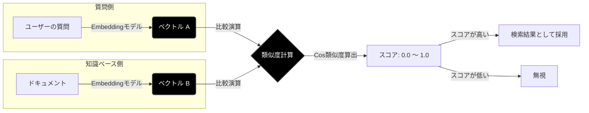

# Qdrant と RAG システム 技術解説書

**作成日:** 2025/12/05
**対象読者:** RAGシステム開発者、AIエンジニア
**前提知識:** Python基礎、機械学習の基本概念

---

## 目次

1. [はじめに：なぜベクトルDBが必要か](#1-はじめになぜベクトルdbが必要か)
2. [Qdrantとは](#2-qdrantとは)
3. [RAGシステムアーキテクチャ](#3-ragシステムアーキテクチャ)
    *   [3.6 RAGのベクトル検索における類似度の図示と説明](#3-6-ragのベクトル検索における類似度の図示と説明)
4. [Qdrantの主要機能](#4-qdrantの主要機能)
5. [他のベクトルDBとの比較](#5-他のベクトルdbとの比較)
6. [実装パターン](#6-実装パターン)
7. [ベストプラクティス](#7-ベストプラクティス)
8. [トラブルシューティング](#8-トラブルシューティング)

---

## 1. はじめに：なぜベクトルDBが必要か

### 1.1 従来の検索の限界

従来のキーワード検索（全文検索）には根本的な限界があります。

```
【キーワード検索の問題】

ユーザーの質問: 「犬の餌やりの頻度は？」

ドキュメントA: 「ワンちゃんには1日2回ご飯をあげましょう」
ドキュメントB: 「犬という単語が含まれる無関係な文書」

→ キーワード「犬」で検索すると、ドキュメントBがヒットし、
  ドキュメントA（正解）は「犬」という単語がないためヒットしない
```

### 1.2 セマンティック検索の登場

**セマンティック検索（意味検索）** は、単語の一致ではなく「意味の近さ」で検索します。

```
【セマンティック検索】

「犬の餌やりの頻度は？」 → ベクトル化 → [0.23, -0.45, 0.12, ...]

ドキュメントA: 「ワンちゃんには1日2回...」 → [0.21, -0.43, 0.15, ...]
                                            ↑ 意味が近い = 類似度高

ドキュメントB: 「犬という単語が...」 → [0.78, 0.32, -0.55, ...]
                                      ↑ 意味が遠い = 類似度低
```

### 1.3 ベクトルDBの役割

**ベクトルDB**は、この「ベクトル（数値配列）」を効率的に保存・検索するための専用データベースです。

```
┌───────────────────────────────────────────────────────┐
│                    ベクトルDBの役割                      │
├───────────────────────────────────────────────────────┤
│  1. ベクトルの保存（数百万〜数十億件）                      │
│  2. 類似度検索（最近傍探索 / ANN）                        │
│  3. メタデータによるフィルタリング                         │
│  4. スケーラブルな分散処理                                │
└───────────────────────────────────────────────────────┘
```

---

## 2. Qdrantとは

### 2.1 概要

**Qdrant**（クアドラント）は、Rust言語で開発された高性能なオープンソースのベクトル検索エンジンです。


| 項目             | 内容                            |
| ---------------- | ------------------------------- |
| **開発元**       | Qdrant Solutions GmbH（ドイツ） |
| **ライセンス**   | Apache 2.0（オープンソース）    |
| **開発言語**     | Rust                            |
| **初版リリース** | 2021年                          |
| **公式サイト**   | https://qdrant.tech             |

### 2.2 名前の由来

「Qdrant」は「Quadrant（象限）」に由来し、多次元空間でのデータ検索を象徴しています。

### 2.3 主な特徴

```
┌─────────────────────────────────────────────────────────┐
│                   Qdrant の特徴                         │
├─────────────────────────────────────────────────────────┤
│  🚀 高性能     : Rust製で高速、メモリ効率が良い          │
│  📦 シンプル   : Docker一発で起動、REST/gRPC API        │
│  🔍 多機能     : フィルタリング、ペイロード、推奨機能    │
│  🌐 スケーラブル: 分散クラスタ対応                       │
│  💾 永続化     : ディスク保存、クラッシュリカバリ        │
│  🆓 オープンソース: 無料で商用利用可能                   │
└─────────────────────────────────────────────────────────┘
```

### 2.4 アーキテクチャ

```
┌─────────────────────────────────────────────────────────┐
│                    Qdrant Server                        │
├─────────────────────────────────────────────────────────┤
│  ┌─────────────┐  ┌─────────────┐  ┌─────────────┐     │
│  │ REST API    │  │ gRPC API    │  │ Web UI      │     │
│  │ :6333       │  │ :6334       │  │ :6333/dashboard│  │
│  └──────┬──────┘  └──────┬──────┘  └──────┬──────┘     │
│         │                │                │             │
│         └────────────────┼────────────────┘             │
│                          ▼                              │
│  ┌─────────────────────────────────────────────────┐   │
│  │              Query Processing Engine             │   │
│  │  ┌─────────┐  ┌─────────┐  ┌─────────────────┐  │   │
│  │  │ Filter  │  │ ANN     │  │ Payload Search  │  │   │
│  │  │ Engine  │  │ Index   │  │                 │  │   │
│  │  └─────────┘  └─────────┘  └─────────────────┘  │   │
│  └─────────────────────────────────────────────────┘   │
│                          │                              │
│                          ▼                              │
│  ┌─────────────────────────────────────────────────┐   │
│  │                Storage Layer                     │   │
│  │  ┌──────────────┐  ┌──────────────────────────┐ │   │
│  │  │ Collections  │  │ Segments (HNSW Index)    │ │   │
│  │  │              │  │                          │ │   │
│  │  │ - vectors    │  │ - Memory-mapped files    │ │   │
│  │  │ - payloads   │  │ - Write-ahead log (WAL)  │ │   │
│  │  └──────────────┘  └──────────────────────────┘ │   │
│  └─────────────────────────────────────────────────┘   │
└─────────────────────────────────────────────────────────┘
```

---

## 3. RAGシステムアーキテクチャ

### 3.1 RAGとは

**RAG（Retrieval-Augmented Generation）** は、LLMの回答生成を外部知識で補強する手法です。

```
RAG = Retrieval（検索） + Augmented（補強された） + Generation（生成）
```

### 3.2 RAGが解決する問題


| 問題                 | RAGによる解決                  |
| -------------------- | ------------------------------ |
| LLMの知識が古い      | 最新ドキュメントを検索して参照 |
| ハルシネーション     | 根拠となるソースを明示         |
| 社内情報を知らない   | プライベートナレッジを検索     |
| コンテキスト長の制限 | 必要な情報だけを抽出して渡す   |

### 3.3 RAGシステム全体像

```
┌─────────────────────────────────────────────────────────────────────┐
│                        RAG System Architecture                       │
└─────────────────────────────────────────────────────────────────────┘

┌─────────────┐     ┌─────────────────────────────────────────────────┐
│             │     │              Indexing Pipeline                   │
│  Documents  │────▶│  ┌─────────┐  ┌─────────┐  ┌─────────────────┐  │
│  (原文)     │     │  │ Chunker │─▶│Embedding│─▶│   Vector DB     │  │
│             │     │  │ 分割    │  │ Model   │  │   (Qdrant)      │  │
└─────────────┘     │  └─────────┘  └─────────┘  └─────────────────┘  │
                    └─────────────────────────────────────────────────┘
                                                          │
                                                          │ 保存
                                                          ▼
┌─────────────┐     ┌─────────────────────────────────────────────────┐
│             │     │              Query Pipeline                      │
│    User     │────▶│  ┌─────────┐  ┌─────────┐  ┌─────────────────┐  │
│   Query     │     │  │Embedding│─▶│ Search  │─▶│   Retrieved     │  │
│             │     │  │ Model   │  │ Qdrant  │  │   Contexts      │  │
└─────────────┘     │  └─────────┘  └─────────┘  └────────┬────────┘  │
                    └────────────────────────────────────│────────────┘
                                                          │
                                                          ▼
┌─────────────┐     ┌─────────────────────────────────────────────────┐
│             │     │              Generation Pipeline                 │
│   Answer    │◀────│  ┌─────────────────────────────────────────────┐│
│             │     │  │  LLM (Gemini/GPT/Claude)                    ││
│             │     │  │                                             ││
│             │     │  │  Prompt = Query + Retrieved Contexts        ││
│             │     │  └─────────────────────────────────────────────┘│
└─────────────┘     └─────────────────────────────────────────────────┘
```

### 3.4 Qdrantの位置づけ（詳細）

RAGシステムにおけるQdrantの役割を詳細に示します。

```
┌─────────────────────────────────────────────────────────────────────┐
│                    RAG における Qdrant の役割                        │
└─────────────────────────────────────────────────────────────────────┘

【役割1: ベクトルの永続化】
  ┌──────────────────────────────────────────────────────────────────┐
  │  Embedding Model                    Qdrant                       │
  │  (text-embedding-004)               Collection                   │
  │                                                                  │
  │  "Pythonの変数宣言"  ───▶  [0.12, -0.34, ...]  ───▶  Point #1   │
  │  "for文の書き方"     ───▶  [0.08, -0.29, ...]  ───▶  Point #2   │
  │  "クラスの定義"      ───▶  [0.15, -0.41, ...]  ───▶  Point #3   │
  │                                     ↓                            │
  │                              永続化（ディスク保存）               │
  └──────────────────────────────────────────────────────────────────┘

【役割2: 類似度検索（ANN）】
  ┌──────────────────────────────────────────────────────────────────┐
  │  Query: "変数の作り方"                                           │
  │                                                                  │
  │       [0.11, -0.32, ...]  ◀── クエリベクトル                     │
  │              │                                                   │
  │              ▼                                                   │
  │       ┌─────────────────────────────────────────────┐           │
  │       │     HNSW Index（近似最近傍探索）            │           │
  │       │                                             │           │
  │       │   Point #1: 距離 0.05 ✓ (最も近い)         │           │
  │       │   Point #2: 距離 0.42                       │           │
  │       │   Point #3: 距離 0.38                       │           │
  │       └─────────────────────────────────────────────┘           │
  │              │                                                   │
  │              ▼                                                   │
  │       Result: Point #1 (Score: 0.95)                            │
  └──────────────────────────────────────────────────────────────────┘

【役割3: メタデータフィルタリング】
  ┌──────────────────────────────────────────────────────────────────┐
  │  Qdrant Payload（メタデータ）                                    │
  │                                                                  │
  │  Point #1: { "category": "python", "difficulty": "beginner" }   │
  │  Point #2: { "category": "python", "difficulty": "advanced" }   │
  │  Point #3: { "category": "java",   "difficulty": "beginner" }   │
  │                                                                  │
  │  Query: "変数の作り方" + Filter: category="python"              │
  │                                                                  │
  │  → Point #1, #2 のみが検索対象（#3は除外）                      │
  └──────────────────────────────────────────────────────────────────┘
```

### 3.5 データフロー（時系列）

```
【インデックス作成時】

Step 1: ドキュメント準備
  docs/manual.pdf ──▶ テキスト抽出 ──▶ "第1章 概要..."

Step 2: チャンク分割
  "第1章 概要..." ──▶ Chunker ──▶ ["第1章 概要", "1.1 目的", ...]

Step 3: 埋め込み生成
  ["第1章 概要", ...] ──▶ Gemini Embedding ──▶ [[0.1, -0.2, ...], ...]

Step 4: Qdrantに保存
  [[0.1, -0.2, ...], ...] ──▶ Qdrant.upsert() ──▶ Collection "manuals"


【検索時】

Step 1: クエリ埋め込み
  "概要を教えて" ──▶ Gemini Embedding ──▶ [0.12, -0.18, ...]

Step 2: Qdrant検索
  [0.12, -0.18, ...] ──▶ Qdrant.search() ──▶ [Point #1 (score: 0.92), ...]

Step 3: コンテキスト取得
  Point #1 ──▶ payload.text ──▶ "第1章 概要: 本マニュアルは..."

Step 4: LLM生成
  Prompt = "質問: 概要を教えて\n参考: 第1章 概要: 本マニュアルは..."
       ──▶ Gemini ──▶ "このマニュアルの概要は..."
```

---

### 3.6 RAGのベクトル検索における類似度の図示と説明

RAG（Retrieval-Augmented Generation）における「ベクトル検索」の核心である、ベクトルA（質問）とベクトルB（ドキュメント）の類似度の概念を図解と解説で示します。

RAGでは、文章の「意味」を数値の列（ベクトル）に変換し、空間上の「向き」の近さで類似度を判定します。

#### 1. ベクトル類似度の幾何学的イメージ

最も一般的に使われる「コサイン類似度（Cosine Similarity）」では、ベクトルの長さ（文章の長さ）ではなく、**「角度（$\theta$）」の近さ（意味の方向）** が重要です。

以下の図は、多次元の意味空間を簡略化して表現したものです。

```text
       [意味の次元 Y]
             ^
             |
             |   ベクトル A (質問)
             |   「Qdrantの使い方」
             |       /
             |      /
             |     /
             |    /  θ1 (角度 小) ➔ 【類似度：高 (〜0.9)】
             |   / . . . . ベクトル B (関連ドキュメント)
             |  //         「Qdrant 技術解説書」
             | //
             |//
(原点 0,0)   O------------------------------> [意味の次元 X]
             \
              \
               \  θ2 (角度 大) ➔ 【類似度：低 (〜0.1)】
                \
                 \
                  \ ベクトル C (無関係なドキュメント)
                    「美味しいカレーの作り方」
```

**【図の解説】**

*   **ベクトル（矢印）**: 文章の意味を表す数値の列です。
*   **角度（θ）**: 矢印同士の開き具合です。これが「意味の類似度」を表します。
    *   **θ1 (AとB)**: 角度が狭いため、意味が近く、検索結果としてヒットします。
    *   **θ2 (AとC)**: 角度が広いため、意味が遠く、無関係と判断されます。

**【なぜ「長さ」ではなく「角度」なのか？】**

「Qdrantとは？」という短い質問と、「QdrantはRust製の…」という長い回答は、文章の長さ（ベクトルの長さ）は大きく異なりますが、**トピックの方向（ベクトルの向き）** は一致します。そのため、距離ではなく角度を見ることで、長さが違っても意味が合うドキュメントを正確に見つけることができます。

#### 2. RAGにおける処理フロー図 (Mermaid)

プログラム的な視点での比較プロセスは以下のようになります。



#### 3. 解説：なぜこれで「意味」がわかるのか？

コンピュータは言葉の意味そのものを理解しているわけではありませんが、Embedding（埋め込み）モデルによって、意味が近い言葉は**多次元空間上の近い場所（同じような方向）**に配置されるように学習されています。

*   **コサイン類似度 ($Cosine Similarity$):**
    *   ベクトル同士のなす角のコサイン値をとります。
    *   **1.0**: 全く同じ向き（完全に一致）。
    *   **0.0**: 直角（無関係）。
    *   **-1.0**: 正反対（反対の意味）。

RAGシステム（Qdrantなど）は、この計算を数百万のドキュメントに対して超高速に行い、「ベクトルA（質問）ともっとも角度が近いベクトルB, C, D...」を見つけ出しています。

---

## 4. Qdrantの主要機能

### 4.1 Collection（コレクション）

コレクションは、ベクトルとペイロードを格納する論理的な単位です。

```python
from qdrant_client import QdrantClient
from qdrant_client.models import Distance, VectorParams

client = QdrantClient(host="localhost", port=6333)

# コレクション作成
client.create_collection(
    collection_name="documents",
    vectors_config=VectorParams(
        size=768,              # ベクトル次元数（Gemini: 768）
        distance=Distance.COSINE  # 類似度計算方法
    )
)
```

### 4.2 Point（ポイント）

ポイントは、ベクトル + ペイロード（メタデータ）の組み合わせです。

```python
from qdrant_client.models import PointStruct

# ポイント追加
client.upsert(
    collection_name="documents",
    points=[
        PointStruct(
            id=1,
            vector=[0.1, -0.2, 0.3, ...],  # 768次元
            payload={
                "text": "Pythonの変数は動的型付けです",
                "category": "python",
                "source": "manual.pdf",
                "page": 10
            }
        ),
        PointStruct(
            id=2,
            vector=[0.2, -0.1, 0.4, ...],
            payload={
                "text": "for文は繰り返し処理に使います",
                "category": "python",
                "source": "manual.pdf",
                "page": 15
            }
        )
    ]
)
```

### 4.3 Search（検索）

```python
# 基本検索
results = client.search(
    collection_name="documents",
    query_vector=[0.12, -0.18, 0.35, ...],  # クエリベクトル
    limit=5  # 上位5件
)

for result in results:
    print(f"ID: {result.id}, Score: {result.score:.4f}")
    print(f"Text: {result.payload['text']}")
```

### 4.4 Filter（フィルタリング）

```python
from qdrant_client.models import Filter, FieldCondition, MatchValue

# フィルタ付き検索
results = client.search(
    collection_name="documents",
    query_vector=query_vector,
    query_filter=Filter(
        must=[
            FieldCondition(
                key="category",
                match=MatchValue(value="python")
            )
        ]
    ),
    limit=5
)
```

### 4.5 距離計算方式


| 方式       | 説明                   | 用途                       |
| ---------- | ---------------------- | -------------------------- |
| **Cosine** | コサイン類似度（角度） | テキスト検索（最も一般的） |
| **Euclid** | ユークリッド距離       | 画像、座標データ           |
| **Dot**    | 内積                   | 推薦システム               |

```python
# Cosine: 値が大きいほど類似（0〜1）
# Euclid: 値が小さいほど類似（0〜∞）
# Dot: 値が大きいほど類似（-∞〜∞）
```

---

## 5. 他のベクトルDBとの比較

### 5.1 比較表


| 項目                   | Qdrant     | Redis (VSS) | Pinecone   | Chroma     | Milvus     |
| ---------------------- | ---------- | ----------- | ---------- | ---------- | ---------- |
| **ライセンス**         | Apache 2.0 | BSD-3       | 商用       | Apache 2.0 | Apache 2.0 |
| **開発言語**           | Rust       | C           | -          | Python     | Go/C++     |
| **デプロイ**           | Self/Cloud | Self        | Cloud only | Self       | Self/Cloud |
| **フィルタリング**     | ◎ 強力    | ○          | ◎         | △         | ◎         |
| **スケーラビリティ**   | ◎         | ○          | ◎         | △         | ◎         |
| **学習コスト**         | 低         | 中          | 低         | 低         | 高         |
| **日本語ドキュメント** | △         | ○          | △         | △         | △         |

### 5.2 Redis vs Qdrant

本プロジェクトでは Redis と Qdrant を併用していますが、役割が異なります。

```
┌─────────────────────────────────────────────────────────────────────┐
│                    Redis vs Qdrant 使い分け                         │
└─────────────────────────────────────────────────────────────────────┘

┌─────────────────────────────────┬─────────────────────────────────┐
│            Redis                │            Qdrant               │
├─────────────────────────────────┼─────────────────────────────────┤
│  【主な用途】                    │  【主な用途】                    │
│  ・セッション管理               │  ・ベクトル検索（メイン）        │
│  ・キャッシュ                   │  ・ナレッジベース               │
│  ・一時データ保存               │  ・長期データ保存               │
│                                 │                                 │
│  【特徴】                       │  【特徴】                       │
│  ・超高速（インメモリ）          │  ・ベクトル検索に特化           │
│  ・TTL（有効期限）設定可能       │  ・フィルタリング機能が豊富     │
│  ・Pub/Sub機能                  │  ・永続化が堅牢                 │
│                                 │                                 │
│  【本プロジェクトでの役割】      │  【本プロジェクトでの役割】      │
│  ・会話履歴のキャッシュ          │  ・RAGのベクトル検索            │
│  ・セッション状態管理            │  ・ドキュメント保存             │
└─────────────────────────────────┴─────────────────────────────────┘
```

### 5.3 選定理由

本プロジェクトでQdrantを選定した理由：


| 理由                  | 詳細                                                       |
| --------------------- | ---------------------------------------------------------- |
| **1. オープンソース** | Apache 2.0ライセンスで商用利用可能、ベンダーロックインなし |
| **2. ローカル実行**   | Docker一発で起動、開発環境での検証が容易                   |
| **3. 高性能**         | Rust製で高速、M2 Macでも快適に動作                         |
| **4. フィルタリング** | カテゴリ別検索など、複雑なクエリに対応                     |
| **5. REST API**       | 直感的なAPI、デバッグが容易                                |
| **6. Web UI**         | 組み込みダッシュボードでデータ確認可能                     |

---

## 6. 実装パターン

### 6.1 基本的なRAG実装

```python
# rag_system.py
"""
Qdrantを使用した基本的なRAGシステム
"""
import google.generativeai as genai
from qdrant_client import QdrantClient
from qdrant_client.models import Distance, VectorParams, PointStruct

class RAGSystem:
    def __init__(
        self,
        qdrant_host: str = "localhost",
        qdrant_port: int = 6333,
        collection_name: str = "knowledge_base",
        embedding_model: str = "models/text-embedding-004"
    ):
        # Qdrantクライアント初期化
        self.client = QdrantClient(host=qdrant_host, port=qdrant_port)
        self.collection_name = collection_name
        self.embedding_model = embedding_model

        # Gemini設定
        genai.configure(api_key=os.getenv("GEMINI_API_KEY"))

    def create_collection(self, vector_size: int = 768):
        """コレクション作成"""
        self.client.recreate_collection(
            collection_name=self.collection_name,
            vectors_config=VectorParams(
                size=vector_size,
                distance=Distance.COSINE
            )
        )

    def embed_text(self, text: str) -> list:
        """テキストをベクトル化"""
        result = genai.embed_content(
            model=self.embedding_model,
            content=text
        )
        return result['embedding']

    def add_documents(self, documents: list[dict]):
        """
        ドキュメント追加
        documents: [{"id": 1, "text": "...", "metadata": {...}}, ...]
        """
        points = []
        for doc in documents:
            vector = self.embed_text(doc["text"])
            points.append(PointStruct(
                id=doc["id"],
                vector=vector,
                payload={
                    "text": doc["text"],
                    **doc.get("metadata", {})
                }
            ))

        self.client.upsert(
            collection_name=self.collection_name,
            points=points
        )

    def search(
        self,
        query: str,
        limit: int = 5,
        score_threshold: float = 0.7
    ) -> list[dict]:
        """類似検索"""
        query_vector = self.embed_text(query)

        results = self.client.search(
            collection_name=self.collection_name,
            query_vector=query_vector,
            limit=limit,
            score_threshold=score_threshold
        )

        return [
            {
                "id": r.id,
                "score": r.score,
                "text": r.payload.get("text", ""),
                "metadata": {k: v for k, v in r.payload.items() if k != "text"}
            }
            for r in results
        ]

    def generate_answer(self, query: str, contexts: list[str]) -> str:
        """LLMで回答生成"""
        model = genai.GenerativeModel("gemini-2.0-flash")

        prompt = f"""以下の参考情報に基づいて質問に回答してください。
参考情報にない内容は「情報が見つかりませんでした」と答えてください。

## 参考情報
{chr(10).join(contexts)}

## 質問
{query}

## 回答
"""
        response = model.generate_content(prompt)
        return response.text

    def query(self, question: str) -> str:
        """RAGクエリ実行（検索→生成）"""
        # 1. 検索
        results = self.search(question)

        if not results:
            return "申し訳ありませんが、関連する情報が見つかりませんでした。"

        # 2. コンテキスト抽出
        contexts = [r["text"] for r in results]

        # 3. 回答生成
        answer = self.generate_answer(question, contexts)

        return answer


# 使用例
if __name__ == "__main__":
    rag = RAGSystem()

    # コレクション作成
    rag.create_collection()

    # ドキュメント追加
    rag.add_documents([
        {"id": 1, "text": "Pythonの変数は動的型付けです。", "metadata": {"category": "python"}},
        {"id": 2, "text": "for文は繰り返し処理に使います。", "metadata": {"category": "python"}},
    ])

    # クエリ実行
    answer = rag.query("変数について教えて")
    print(answer)
```

### 6.2 本プロジェクトでの実装

```python
# agent_tools.py での Qdrant 利用パターン

def search_rag_knowledge_base(query: str, collection_name: str = "qa_pairs") -> str:
    """
    【処理フロー】

    1. クエリ → 埋め込みベクトル
       "APIの仕様は？" → [0.12, -0.34, 0.56, ...]

    2. Qdrant検索
       qdrant.search(
           collection="qa_pairs",
           vector=[0.12, -0.34, 0.56, ...],
           limit=5
       )

    3. スコアフィルタリング
       score >= 0.7 のみ採用

    4. 結果フォーマット
       "Q: ... A: ... Score: 0.85"
    """
    pass
```

---

## 7. ベストプラクティス

### 7.1 コレクション設計

```
【推奨】目的別にコレクションを分割

✅ 良い例:
  - qa_pairs        : FAQ、Q&Aデータ
  - internal_docs   : 社内技術ドキュメント
  - company_rules   : 就業規則、社内規定
  - product_manuals : 製品マニュアル

❌ 悪い例:
  - all_documents   : 全ドキュメントを1つに（検索精度低下）
```

### 7.2 チャンク分割

```
【推奨】適切なチャンクサイズ

✅ 推奨サイズ: 200〜500トークン（約400〜1000文字）
✅ オーバーラップ: 50〜100トークン（文脈保持）

❌ 小さすぎ: 文脈が失われる
❌ 大きすぎ: 検索精度が低下、トークン消費増
```

```python
# チャンク分割の例
from langchain.text_splitter import RecursiveCharacterTextSplitter

splitter = RecursiveCharacterTextSplitter(
    chunk_size=500,
    chunk_overlap=100,
    separators=["\n\n", "\n", "。", "、", " "]
)

chunks = splitter.split_text(document_text)
```

### 7.3 スコア閾値

```python
# 推奨閾値設定
RAG_SCORE_THRESHOLD = 0.7  # Cosine類似度

# 閾値の考え方
# 0.9以上: 非常に高い関連性（完全一致に近い）
# 0.7-0.9: 高い関連性（採用推奨）
# 0.5-0.7: 中程度の関連性（要検討）
# 0.5未満: 低い関連性（除外推奨）
```

### 7.4 インデックス最適化

```python
# HNSW インデックス設定
from qdrant_client.models import HnswConfigDiff

client.update_collection(
    collection_name="documents",
    hnsw_config=HnswConfigDiff(
        m=16,              # グラフの接続数（デフォルト16）
        ef_construct=100,  # インデックス構築時の探索数
    )
)

# 検索時の設定
results = client.search(
    collection_name="documents",
    query_vector=query_vector,
    limit=5,
    search_params={"hnsw_ef": 128}  # 検索時の探索数（大きいほど精度↑速度↓）
)
```

---

## 8. トラブルシューティング

### 8.1 よくある問題


| 問題             | 原因                   | 解決策                           |
| ---------------- | ---------------------- | -------------------------------- |
| 接続エラー       | Qdrantが起動していない | `docker-compose up -d qdrant`    |
| 検索結果が0件    | コレクションが空       | ドキュメント投入を確認           |
| スコアが常に低い | 埋め込みモデルの不一致 | 登録時と検索時で同じモデルを使用 |
| メモリ不足       | 大量データ             | ディスクモードを有効化           |

### 8.2 デバッグ方法

```python
# 1. コレクション情報確認
info = client.get_collection("documents")
print(f"Point count: {info.points_count}")
print(f"Vector size: {info.config.params.vectors.size}")

# 2. サンプルデータ取得
points = client.scroll(
    collection_name="documents",
    limit=5
)
for point in points[0]:
    print(f"ID: {point.id}, Payload: {point.payload}")

# 3. Web UI確認
# http://localhost:6333/dashboard
```

### 8.3 パフォーマンスチューニング

```yaml
# docker-compose.yml での設定例
services:
  qdrant:
    image: qdrant/qdrant:latest
    ports:
      - "6333:6333"
      - "6334:6334"
    volumes:
      - ./qdrant_data:/qdrant/storage
    environment:
      - QDRANT__STORAGE__ON_DISK_PAYLOAD=true  # ペイロードをディスクに
      - QDRANT__SERVICE__MAX_REQUEST_SIZE_MB=50
```

---

## 付録

### A. 用語集


| 用語           | 説明                                                      |
| -------------- | --------------------------------------------------------- |
| **Vector**     | 数値の配列。テキストの意味を数学的に表現                  |
| **Embedding**  | テキストをベクトルに変換すること/変換結果                 |
| **Collection** | Qdrantでベクトルを格納する論理単位                        |
| **Point**      | ベクトル + メタデータ（Payload）の組                      |
| **Payload**    | ベクトルに付随するメタデータ（JSON）                      |
| **ANN**        | Approximate Nearest Neighbor（近似最近傍探索）            |
| **HNSW**       | Hierarchical Navigable Small World（高速ANNアルゴリズム） |

### B. 参考リンク

- [Qdrant 公式ドキュメント](https://qdrant.tech/documentation/)
- [Qdrant GitHub](https://github.com/qdrant/qdrant)
- [Gemini Embedding API](https://ai.google.dev/gemini-api/docs/embeddings)
- [RAG論文（Lewis et al., 2020）](https://arxiv.org/abs/2005.11401)

### C. Docker Compose 設定例

```yaml
# docker-compose.yml
version: '3.8'

services:
  qdrant:
    image: qdrant/qdrant:latest
    container_name: qdrant
    ports:
      - "6333:6333"  # REST API
      - "6334:6334"  # gRPC
    volumes:
      - ./qdrant_data:/qdrant/storage
    restart: unless-stopped

  redis:
    image: redis:7-alpine
    container_name: redis
    ports:
      - "6379:6379"
    volumes:
      - ./redis_data:/data
    command: redis-server --appendonly yes
    restart: unless-stopped
```

---

**Document Version:** 1.0
**Last Updated:** 2025/12/05
