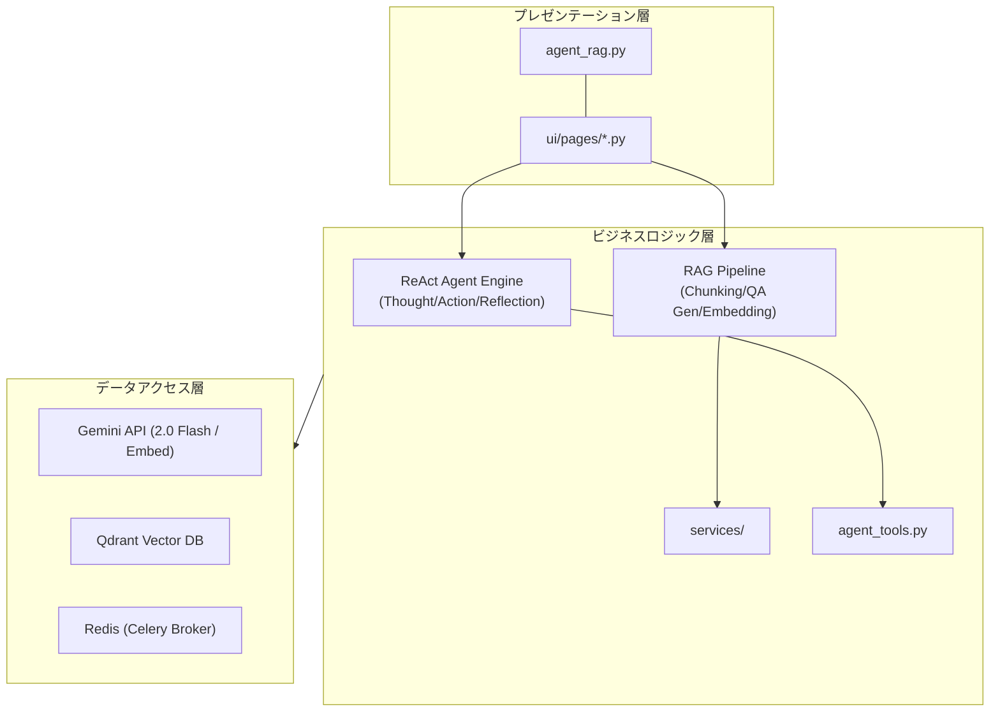
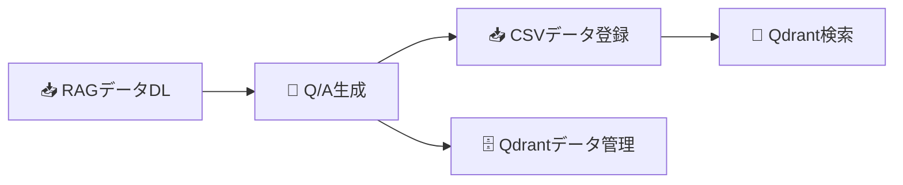

# Agent RAG システム 統合ドキュメント

本システムは、Gemini 3世代に対応した「自律型 RAG エージェント」および統合管理プラットフォームです。
Streamlit ベースの UI を通じて、データの取得・ベクトル化から Qdrant データベース管理、そして高度なエージェント対話まで、RAG パイプライン全体を一気通貫で管理・運用することができます。

## 目次

1. [システム概要](#1-システム概要)
2. [クイックスタート](#2-クイックスタート)
3. [機能ガイド: エージェント対話](#3-機能ガイド-エージェント対話)
4. [機能ガイド: RAGデータパイプライン](#4-機能ガイド-ragデータパイプライン)
5. [技術詳細: エージェントロジック](#5-技術詳細-エージェントロジック)
6. [技術詳細: RAGアルゴリズム](#6-技術詳細-ragアルゴリズム)
7. [リファレンス](#7-リファレンス)

---

## 1. システム概要

### 1.1 コンセプト

本システムは、以下の2つの主要コンポーネントを統合しています。

1.  **RAGデータ基盤**: ドキュメントから高品質なQ/Aペアを自動生成し、ベクトルデータベース(Qdrant)へ登録するパイプライン。
2.  **自律型エージェント**: 登録された知識を検索(Retrieval)し、ReAct + Reflection プロセスを用いてユーザーに回答するAIエージェント。

### 1.2 主な特徴

*   **ReAct (Reasoning + Acting)**:
    エージェントが自ら「考え（Reasoning）」、「行動（Acting）」するループを実行。必要な情報が揃うまで自律的に検索ツールを行使します。
*   **Reflection (自己省察と推敲)**:
    回答を作成した後、即座に出力せず「自己評価」フェーズを実行。ハルシネーションのチェックやスタイル修正を行い、回答品質を向上させます。
*   **Gemini 2.0 Flash 活用**:
    高速・高性能な Gemini 2.0 Flash を推論エンジンおよびQ/A生成に全面的に採用。
*   **RAGパイプライン管理**:
    データ取得、SemanticCoverageによるチャンク分割、Celeryによる並列Q/A生成、Hybrid Search対応のQdrant登録までをGUIで操作可能。

### 1.3 全体アーキテクチャ



---

## 2. クイックスタート

### 2.1 前提条件

*   Python 3.10以上
*   Docker & Docker Compose (Qdrant, Redis用)
*   Google Gemini API キー (または OpenAI APIキー)

### 2.2 インストール

```bash
# リポジトリのクローン
git clone <repository-url>
cd gemini_agent_rag

# 依存パッケージのインストール
pip install -r requirements.txt

# 環境変数の設定
cp .env.example .env
# .envを編集し、GEMINI_API_KEY (または OPENAI_API_KEY) などを設定
```

### 2.3 サービス起動

```bash
# 1. Qdrant + Redis の起動
docker-compose -f docker-compose/docker-compose.yml up -d

# 2. (任意) Celeryワーカー起動（Q/A生成の並列処理を行う場合）
./start_celery.sh start -w 8

# 3. 統合アプリの起動
streamlit run agent_rag.py --server.port=8500
```

### 2.4 動作確認

ブラウザで `http://localhost:8500` を開き、統合アプリが表示されることを確認してください。

---

## 3. 機能ガイド: エージェント対話

メニューの **「🤖 エージェント対話」** から利用できます。

### 3.1 ReAct + Reflection エージェントの特徴

ReActエージェントは、単に知識を検索して答えるだけでなく、以下のプロセスを経て回答を生成します。

1.  **思考 (Thought)**: ユーザーの質問に対し、検索が必要か、どのキーワードで検索すべきかを考えます。
2.  **行動 (Action)**: 実際に検索ツール (`search_rag_knowledge_base`) を呼び出し、Qdrantから情報を取得します。
3.  **観察 (Observation)**: 検索結果を確認し、十分な情報が得られたか判断します。不足していれば検索を繰り返します（Multi-turn）。
4.  **推敲 (Reflection)**: 回答案を作成した後、自己評価を行います。「検索結果に基づいているか？」「日本語として自然か？」などをチェックし、必要に応じて修正してから最終回答を出力します。

### 3.2 画面の使い方

*   **チャット入力**: 画面下部の入力欄に質問を入力します。
*   **思考プロセスの確認**: 回答生成中、`Thought` や `Action` のログがアコーディオン形式（`Expander`）で表示されます。エージェントが何を考えているかを確認できます。
*   **コレクション選択**: サイドバーで検索対象とするQdrantコレクションを選択・変更できます。

---

## 4. 機能ガイド: RAGデータパイプライン

エージェントが検索する「知識」を作成・管理する機能群です。

### 4.1 処理フロー



### 4.2 各機能の説明

#### 📥 RAGデータDL
Hugging Face やローカルファイルからデータセットを取得し、前処理を行います。
*   **対応データ**: `wikipedia_ja`, `cc_news`, `livedoor`, カスタムテキスト
*   **出力**: 前処理済みのテキストファイル

#### 🤖 Q/A生成
ドキュメントからQ/Aペアを自動生成します。
*   **チャンク分割**: `SemanticCoverage` により、意味的なまとまりを維持してテキストを分割。
*   **生成モデル**: Gemini 2.0 Flash などを利用。
*   **並列処理**: Celery を有効にすることで、大量のドキュメントを高速に処理可能。

#### 📥 CSVデータ登録 (Qdrant登録)
生成されたQ/Aペア（CSV）をベクトル化し、Qdrantデータベースに登録します。
*   **Embedding**: Gemini Embedding (`text-embedding-004`) または OpenAI Embedding を使用。
*   **ハイブリッド検索対応**: Dense Vector (意味検索) と Sparse Vector (キーワード検索) の両方をサポート設定可能。

#### 🗄️ Qdrantデータ管理 (Show-Qdrant)
登録済みのQdrantコレクションの内容を確認・削除できます。

#### 🔎 Qdrant検索
ベクトル検索の精度を単体でテストするための画面です。エージェントを介さず、直接類似度検索を行います。

---

## 5. 技術詳細: エージェントロジック

### 5.1 ReAct ループの仕組み

`ui/pages/agent_chat_page.py` 内の `run_agent_turn` 関数が制御の中核です。

1.  **ユーザー入力**: 文字列を Gemini API に送信。
2.  **Function Call 検知**: モデルが `search_rag_knowledge_base` などのツール利用を要求した場合、Python側で関数を実行。
3.  **Observation 返送**: 実行結果（検索結果）を `function_response` としてモデルに返送。
4.  **ループ**: モデルが回答可能と判断するまで 2〜3 を繰り返す。

### 5.2 Reflection (自己省察)

回答案（Draft Answer）生成後、システムは以下の `REFLECTION_INSTRUCTION` を付与して再度モデルに問い合わせます。

> 「以下の基準で客観的に評価し...修正してください...思考プロセスは Thought: で始めてください。」

モデルはこれに従い、自らの回答を批評（Critique）し、修正版（Revise）を出力します。これにより、ハルシネーション（嘘）の低減と、丁寧な口調への統一を実現しています。

### 5.3 クエリ生成の自律性

本システムでは、Pythonコード側で検索クエリのキーワード抽出を行っていません。
Geminiモデル自体が、文脈を理解し、「検索エンジンに入力すべき最適なクエリ」を自律的に生成（推論）してツールに渡しています。

---

## 6. 技術詳細: RAGアルゴリズム

### 6.1 チャンク分割 (SemanticCoverage)

`helper_rag.py` 内の `SemanticCoverage` クラスが担当します。

*   **段落優先**: 単なる文字数分割ではなく、段落（改行）を優先して意味の切れ目を維持。
*   **MeCab活用**: 日本語テキストの場合、形態素解析を用いて文の境界を正確に判定。
*   **トピック連続性**: 短すぎるチャンクは前後のチャンクと結合し、情報の断片化を防ぎます。

### 6.2 プロンプトエンジニアリング (Q/A生成)

Q/A生成時は、2段階のプロンプト構成を採用しています。

1.  **システムプロンプト**: 教育コンテンツ作成の専門家としての役割定義。
2.  **ユーザープロンプト**: 構造化出力（JSONスキーマ）を強制し、「事実確認型」「理由説明型」など多様な観点からの質問生成を指示。

### 6.3 ハイブリッド検索 (Hybrid Search)

`services/qdrant_service.py` では、Qdrant の機能を活用し、以下の検索をサポートします。

*   **Dense Search**: 意味的な類似度による検索（Embedding）。
*   **Sparse Search**: キーワードの一致度による検索（BM25等）。※設定により有効化
*   これらを組み合わせることで、表記揺れに強く、かつ専門用語も逃さない検索を実現します。

---

## 7. リファレンス

### 7.1 ディレクトリ構造

```
gemini_agent_rag/
├── agent_rag.py               # メインアプリ (Streamlit Entrypoint)
├── agent_tools.py             # エージェント用ツール定義
├── celery_tasks.py            # Celeryタスク定義 (非同期処理)
├── config.py                  # 設定管理
├── docker-compose/            # インフラ設定 (Qdrant, Redis)
├── doc/                       # ドキュメント
├── helper_*.py                # 各種ヘルパー (API, Embedding, RAG)
├── services/                  # ビジネスロジック層
│   ├── dataset_service.py     # データセット操作
│   ├── file_service.py        # ファイル操作
│   ├── log_service.py         # ログ管理
│   ├── qa_service.py          # Q/A生成ロジック
│   └── qdrant_service.py      # Qdrant操作・検索ロジック
└── ui/                        # プレゼンテーション層
    └── pages/                 # 各機能ページ
```

### 7.2 必須環境変数 (.env)

| 変数名 | 説明 |
| :--- | :--- |
| `GEMINI_API_KEY` | Google Gemini APIを利用する場合に必要 |
| `OPENAI_API_KEY` | OpenAI APIを利用する場合に必要 (互換性維持) |
| `QDRANT_URL` | QdrantサーバーのURL (例: `http://localhost:6333`) |
| `REDIS_URL` | RedisサーバーのURL (例: `redis://localhost:6379/0`) |

### 7.3 対応データセット

| データセット | 識別子 | 説明 |
| :--- | :--- | :--- |
| Wikipedia日本語 | `wikipedia_ja` | HuggingFaceより取得 |
| CC-News | `cc_news` | ニュース記事データセット |
| Livedoorニュース | `livedoor` | 日本語ブログ記事コーパス |
| カスタム | `custom_upload` | ユーザー独自のテキストデータ |

---

## ライセンス

MIT License
