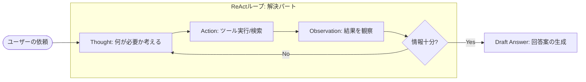
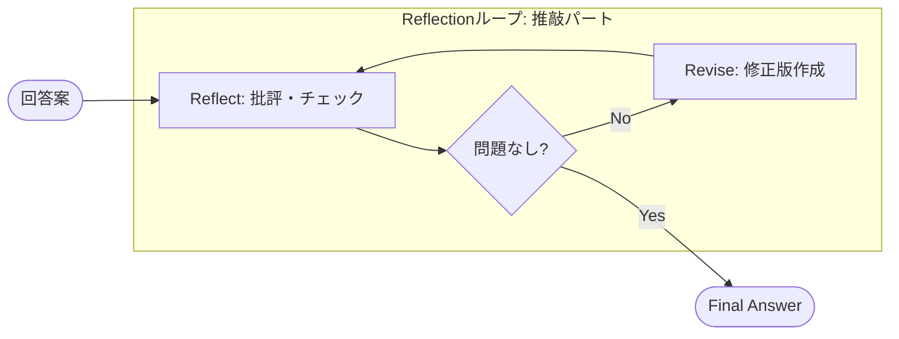
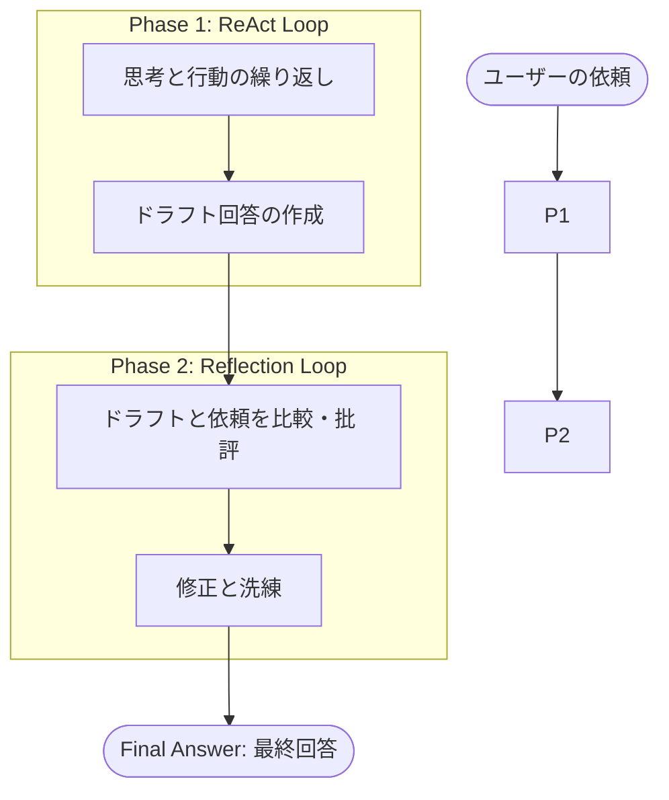
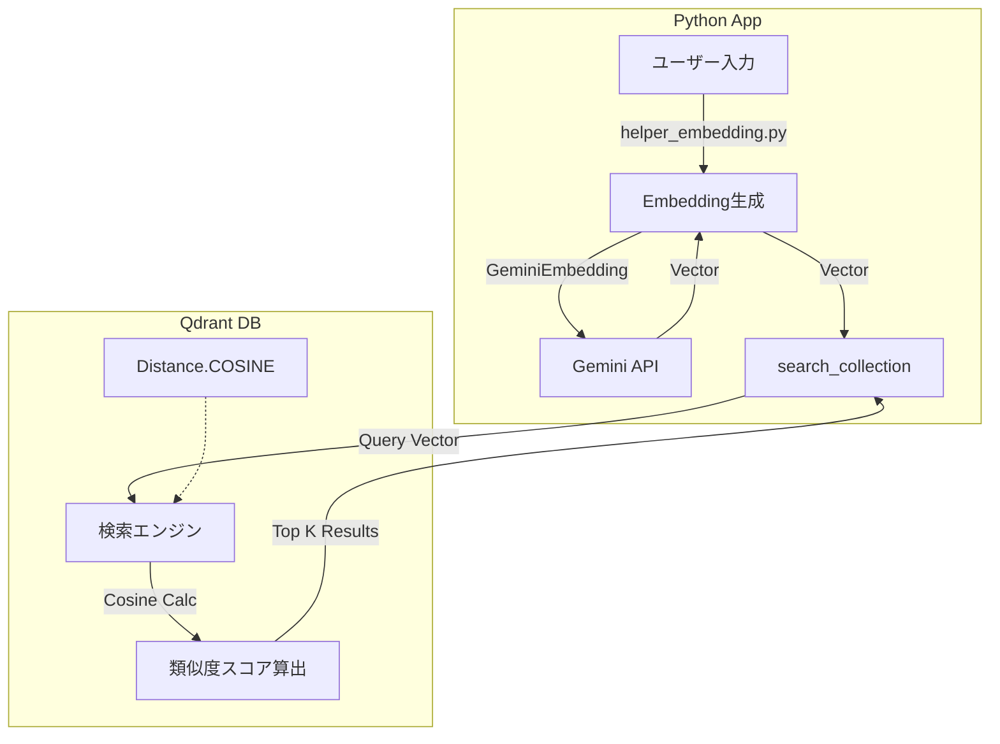

## Agent React + Reflection
ReActはAIエージェントの中核となる非常に重要な概念です。

--- ------------------------------
Phase 1: ReAct（試行錯誤による解決）
ReActは、**「考え（Reasoning）」ながら「行動（Acting）」し、その結果を見てまた「考える」**という、人間のような試行錯誤を行うプロセスです。
このフェーズでは、AIは単に回答を出力するのではなく、外部ツール（検索や計算機など）を使いながら、情報が揃うまで行動を繰り返します。

• 動作原理: 「思考(Thought) → 行動(Action) → 観察(Observation)」のループを回します。
• 具体例: 「東京の気温を2倍にすると？」という問いに対し、「検索（今の気温は15度）」→「計算（15×2）」というステップを踏んで答えを導き出します,。
• 役割: ここではユーザーへの最終回答ではなく、まずは事実に基づいた**「ドラフト回答（Draft Answer）」**を作成することに集中します。

Phase 2: Reflection（自己反省と推敲）
Reflectionは、**「一度書いたものを自分で読み直して直す」**という自己修正のプロセスです。人間が文章を推敲する作業に相当します。
このフェーズでは、生成された回答に対して客観的な批評を行い、品質を高めます。

• 動作原理: 「作成(Generate/Draft) → 批評(Reflect) → 修正(Revise)」を繰り返します,。
• チェック内容: 「事実に誤りはないか？」「ユーザーの意図を満たしているか？」「余計な情報はないか？」などを客観的に確認します。
• 強み: コード生成におけるバグ確認や、文章執筆の品質向上に適しています。

Phase 3: ReAct + Reflection（合体による効果）
Phase 1（解決）とPhase 2（推敲）を組み合わせることで、「動く（Action）」フェーズと「考える（Reflection）」フェーズが連携し、より高度な成果物を生み出します。

この組み合わせには、主に以下の3つの効果（メリット）があります。
1. 情報の正確性向上: ReActで取得したデータ（数字や単位など）を文章化する際に起こりがちなミスを、Reflection層で「元データと合っているか？」確認することで防ぎます。
2. 回答スタイルの統一（UX向上）: ReActの出力は論理的で機械的になりがちですが、Reflection層で「親しみやすいトーンで」「箇条書きで」といった推敲を行うことで、ユーザー体験（UX）を向上させます。
3. 安全性の確保: 不適切な内容やプロンプトインジェクションが含まれていないか、最後にガードレールとしてチェックする機能を果たします

---
## 実装構造 (Embedding & Cosine Similarity)

`agent_rag.py` および関連モジュールにおける **Embedding（ベクトル化）** と **Cosine Similarity（コサイン類似度計算）** の実装構造です。

### 1. Embedding (ベクトル化) の構成

ベクトル化処理は `helper_embedding.py` に集約され、他のモジュールからは抽象化されたラッパー関数を通じて利用される構造になっています。

#### クラス構成: `helper_embedding.py`
| 項目 | 詳細 |
| :--- | :--- |
| **抽象基底クラス** | `EmbeddingClient` |
| **実装クラス** | 1. **`GeminiEmbedding`**: Google Gemini API (`models.embed_content`) を使用。現在の主力 (3072次元)。 2. **`OpenAIEmbedding`**: OpenAI API (`embeddings.create`) を使用。レガシー/互換用 (1536次元)。 |
| **ファクトリ関数** | `create_embedding_client(provider="gemini", ...)` 引数 `provider` により、使用するクラスを切り替えます。 |

#### ラッパー関数による利用
| モジュール | 関数 (IPO) |
| :--- | :--- |
| **`helper_embedding.py`** | **`GeminiEmbedding.embed_text`** - Input: テキスト (str) - Process: Gemini API (`embed_content`) 呼び出し - Output: ベクトル (List[float]) |
| **`qdrant_client_wrapper.py`** | **`embed_texts_unified`** - Input: テキストリスト, プロバイダー - Process: `helper_embedding` を呼び出しバッチ処理 - Output: ベクトルリスト (List[List[float]]) |
| **`services/qdrant_service.py`** | **`embed_texts_for_qdrant`** - Input: テキストリスト - Process: `embed_texts_unified` へのエイリアス - Output: ベクトルリスト |

---

### 2. コサイン類似度 (Cosine Similarity) の構成

コサイン類似度の計算自体は **Qdrant データベースエンジン（サーバーサイド）** 内部で実行されます。Pythonコード側では、「計算方式の指定（設定）」と「検索リクエストの送信」を行っています。

#### 構成概要
| 項目 | 詳細 |
| :--- | :--- |
| **計算実行場所** | Qdrant Server (Rust実装の検索エンジン内) |
| **設定方法** | コレクション作成時に `distance=models.Distance.COSINE` を指定 |
| **検索実行** | クライアントからクエリベクトルを送信し、サーバー側でスコア計算・ソート |

#### 関連関数 (IPO)
| 処理フェーズ | モジュール / 関数 | 詳細 (Input / Process / Output) |
| :--- | :--- | :--- |
| **設定 (Setup)** | `qdrant_client_wrapper.py` `create_or_recreate_collection` | **Input**: `client`, `name`, `vector_size` **Process**: `VectorParams(distance=models.Distance.COSINE)` を設定してコレクション作成APIを叩く **Output**: なし (サーバー上に設定保存) |
| **実行 (Runtime)** | `qdrant_client_wrapper.py` `search_collection` | **Input**: `client`, `collection_name`, `query_vector` **Process**: `client.search` (または `query_points`) を呼び出す。Qdrant内部で全ベクトルとのコサイン類似度が計算される **Output**: 検索結果リスト (スコア付き) |

### 構造まとめ図 (Mermaid)

