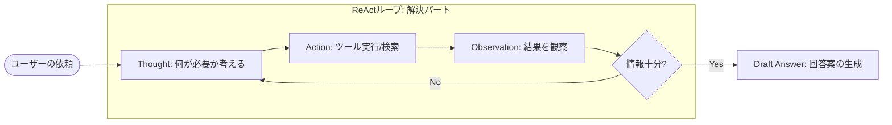
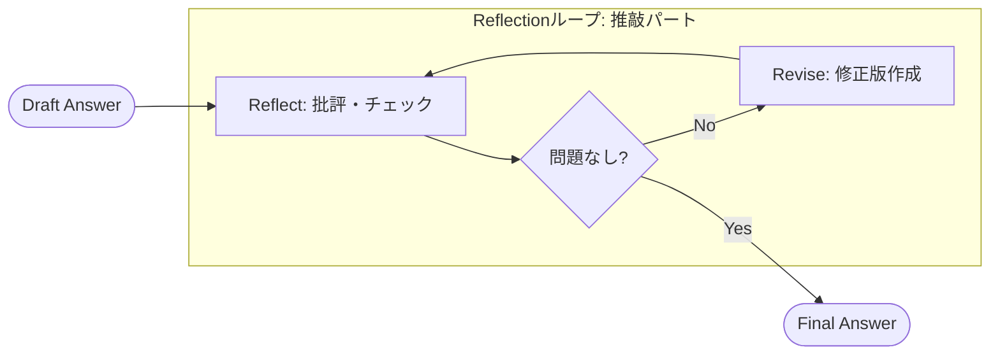
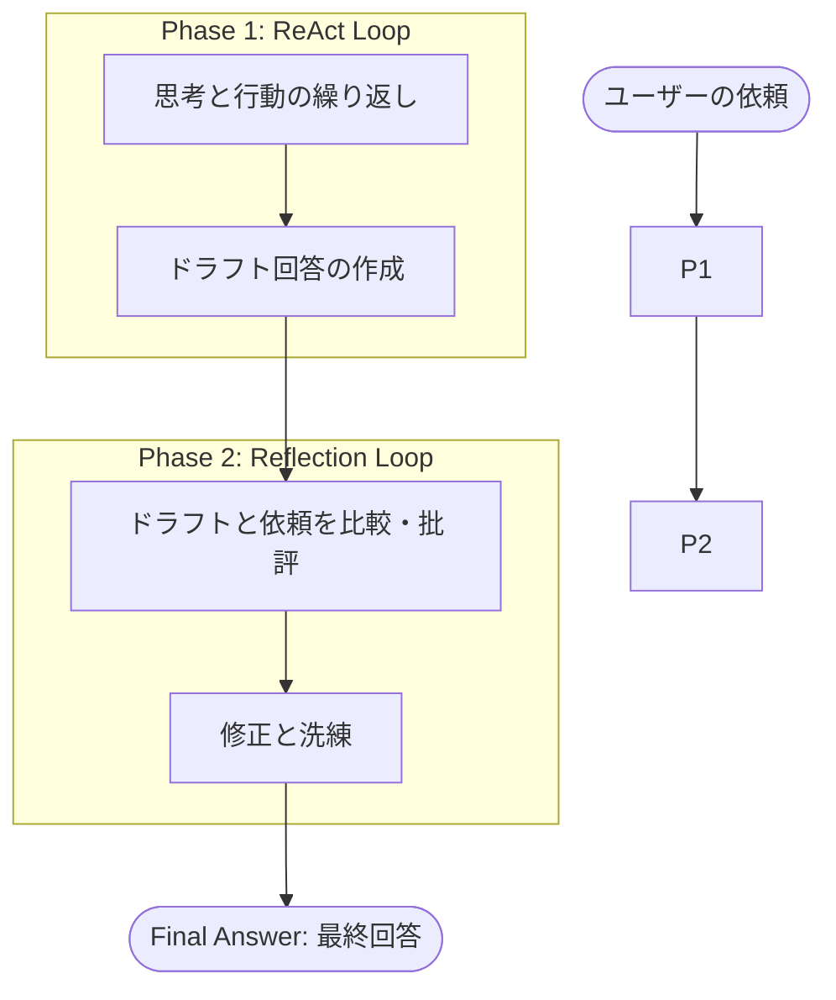
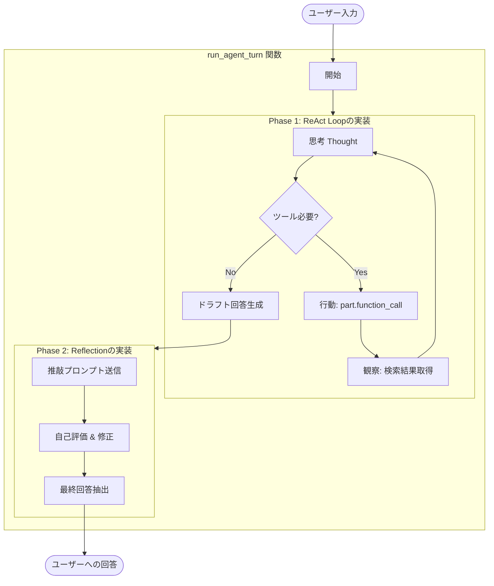
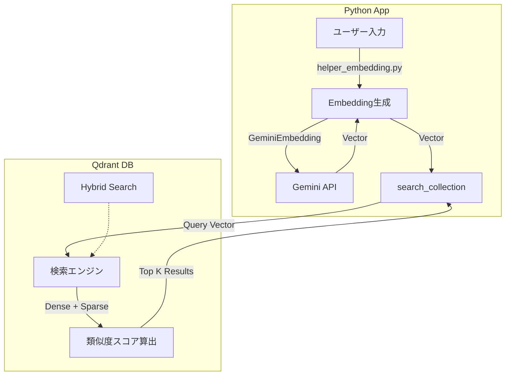
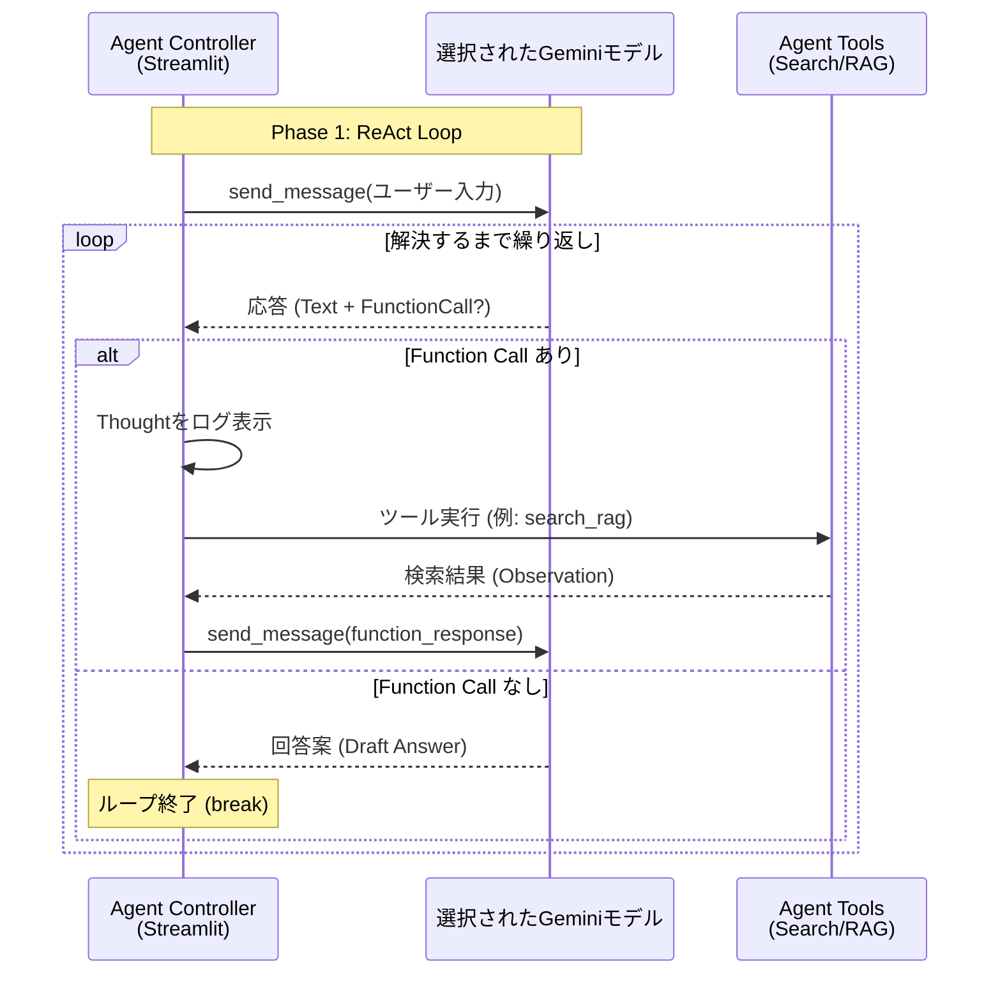
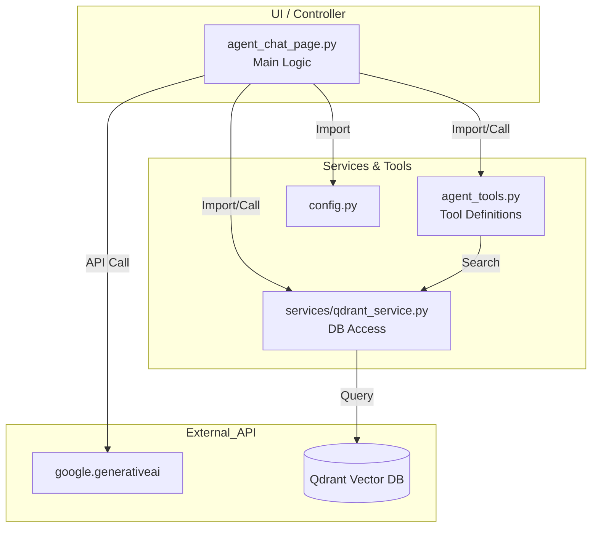

# Gemini Hybrid RAG Agent - 理論と実装リファレンス

本ドキュメントは、ReAct + Reflection エージェントの理論的背景（概念図）と、ユーザーが選択可能なGeminiモデルを活用した`agent_rag.py` および関連モジュールの実装詳細を体系的にまとめたリファレンスです。

---

# 第1部: アーキテクチャ概念 (Theoretical Architecture)

Gemini エージェントの思考プロセスは、大きく2つのフェーズ（解決と推敲）で構成されています。

## 1.1 Phase 1: ReAct (試行錯誤による解決)
ReActは、**「考え（Reasoning）」ながら「行動（Acting）」し、その結果を見てまた「考える」**というプロセスです。
AIは単に回答を出力するのではなく、外部ツール（検索など）を使いながら、情報が揃うまで行動を繰り返します。



*   **Thought**: 現在の状態を分析し、次に何をすべきか計画します。
*   **Action**: ツール（検索）を実行します。
*   **Observation**: ツールの実行結果（検索結果）を受け取ります。

### 入力文字列から検索クエリ生成までの処理構造

Pythonコード側で「キーワード抽出」や「クエリ整形」を行う専用の関数は実装されていません。
Geminiモデル自体が、システムプロンプトの指示に基づき、「入力文」を解釈し、「最適な検索クエリ」へと変換（推論） しています。

1. 入力フェーズ (Pythonコード: `ui/pages/agent_chat_page.py`)

* ユーザーの行動:
  チャット画面に自然文で質問を入力します。
  > 具体例: 「実験生物学では、生物の機構を解明するためにどのような操作を加えますか？」

* コード処理 (`run_agent_turn` 関数):
  この文字列はそのまま Gemini API (chat_session.send_message) に渡されます。
  同時に、システムプロンプト (SYSTEM_INSTRUCTION_TEMPLATE) によって、モデルには以下の「思考のルール」が与えられています。
  > 指示: 「Thought: [なぜ検索が必要か、どのコレクションを、どんなクエリで検索するか]」

2. 生成・推論フェーズ (Gemini API 内部)

* モデルの思考 (Reasoning):
  モデルはプロンプトの指示に従い、ユーザーの意図を汲み取りつつ、検索ツール (search_rag_knowledge_base)
  に渡すべき最適な引数を考えます。
  > 思考例: 「このユーザーの質問は長い。Qdrantで正確に検索するには、助詞を省いて重要なキーワードに絞ったほうが良いだろう。」

* クエリの決定 (Function Call 生成):
  モデルは思考の結果に基づき、ツールの引数 query を生成します。ここでの出力が、実際の検索クエリとなります。

  > 生成パターン例:
  >    ケースA (重要語抽出)*: "実験生物学 生物の機構 操作"
  >    ケースB (キーワード化)*: "実験生物学 実験操作"
  >    ケースC (そのまま)*: "実験生物学では、生物の機構を解明するためにどのような操作を加えますか？"


※現状のプロンプトでは「キーワードのみにせよ」という強制はないため、モデルの文脈判断によりケースA～Cのように変動します。しかし、Gemini
2.0 Flashは一般的に、検索に適した形（ケースAやB）へ自発的に変換する傾向があります。

3. 伝達・実行フェーズ (Pythonコード: `agent_tools.py`)

* コード処理 (`run_agent_turn` -> `search_rag_knowledge_base`):
  Gemini API から返ってきた function_call 情報（モデルが決めたクエリ）を Python 側で受け取り、そのまま検索関数を実行します。

```python
# agent_tools.py
def search_rag_knowledge_base(query: str, ...):
    # ここに来る時点で、query は既にモデルによって
    # "実験生物学 実験操作" などに変換されている可能性がある
    return qdrant_service.search_collection_rag(query, ...)
```

まとめ

| フェーズ | 担当             | 処理内容                                 | 具体例                                  |
| :------- | :--------------- | :--------------------------------------- | :------------------------------------------ |
| 1. 入力  | agent_chat_page.py | ユーザーの自然文を受け取る               | 「実験生物学では...操作を加えますか？」 |
| 2. 変換  | Gemini (LLM)     | 文脈から「検索用クエリ」を推論・生成する | 「実験生物学 実験操作」 (ケースB)       |
| 3. 実行  | agent_tools.py   | 生成されたクエリで検索を実行する         | query="実験生物学 実験操作" で検索      |


つまり、「クエリ生成ロジック」の実体は Python コードではなく、LLM の頭脳（推論プロセス）の中 にあります。


## 1.2 Phase 2: Reflection (自己省察と推敲)
Reflectionは、生成された回答（ドラフト）に対して客観的な批評を行い、品質を高めるプロセスです。



*   **Reflect**: 正確性、適切性、スタイルをチェックします。
*   **Revise**: 問題があれば修正し、最終回答を生成します。

## 1.3 統合モデル (ReAct + Reflection)
「動く（Action）」フェーズと「考える（Reflection）」フェーズを連携させることで、より高度な成果物を生み出します。



---

# 第2部: 実装詳細 (Implementation Details)

上記の理論が、実際のPythonコードでどのように実装されているか解説します。

## 2.1 エージェント制御: `ui/pages/agent_chat_page.py`

エージェントのライフサイクル管理を行うメインコントローラーです。

*   **`setup_agent(selected_collections, model_name)` 関数**:
    *   **役割**: エージェントを初期化し、`google.generativeai.GenerativeModel` インスタンスを生成します。
    *   **詳細**: UIでユーザーが選択した `model_name` を引数として受け取り、そのモデル名を使用してLLMをセットアップします。これにより、利用するGeminiモデルを動的に切り替えることが可能です。

### ReActループの実装 (`run_agent_turn`)
Gemini API の `function_call` 機能と Python の `while` ループを組み合わせて ReAct を実現しています。



*   **コード対応**: `run_agent_turn` 関数内の `while turn_count < max_turns:` ループ。
*   **Thoughtの可視化**: モデルが出力する `Thought:` パートを抽出し、Streamlit UI (`st.expander`) にリアルタイム表示します。

### プロンプト設計
*   **Router Guidelines (`SYSTEM_INSTRUCTION_TEMPLATE`)**:
    *   **役割**: どのコレクション（`wikipedia_ja`, `livedoor`, `cc_news`）を使うべきかの判断基準を提供します。
    *   **実装**: LLMはこのガイドラインに従い、自律的に適切なコレクションを選択します。
*   **Reflection Strategy (`REFLECTION_INSTRUCTION`)**:
    *   **役割**: ドラフト回答に対する評価基準（正確性・適切性・スタイル）を定義します。

## 2.2 ツール定義: `agent_tools.py`

LLM が呼び出すことができる「手足」となる関数群です。

*   **`search_rag_knowledge_base(query, collection_name)`**:
    *   **役割**: 指定されたコレクションに対して検索を実行します。
    *   **詳細**: `services.qdrant_service.search_collection_rag` をラップし、LLMが使いやすいインターフェースを提供します。
*   **`list_rag_collections()`**:
    *   **役割**: 現在利用可能なコレクションの一覧を返します。

## 2.3 知識ベース検索: `services/qdrant_service.py`

Qdrant データベースとの対話、Embedding 生成、ハイブリッド検索を担当するコアモジュールです。

### Embedding (ベクトル化) の構成
`helper_embedding.py` に集約され、抽象化されています。

| 項目 | 詳細 |
| :--- | :--- |
| **抽象基底クラス** | `EmbeddingClient` |
| **実装クラス** | 1. **`GeminiEmbedding`**: Gemini API (`models.embed_content`) を使用。現在の主力。<br>2. **`OpenAIEmbedding`**: OpenAI API を使用。レガシー/互換用。 |
| **ファクトリ関数** | `create_embedding_client(provider="gemini", ...)` |

### 検索ロジック (Hybrid Search)
Qdrant の **Hybrid RAG (Dense + Sparse)** 機能を活用しています。

| 処理フェーズ | モジュール / 関数 | 詳細 (Input / Process / Output) |
| :--- | :--- | :--- |
| **設定 (Setup)** | `qdrant_client_wrapper.py`<br>`create_or_recreate_collection` | **Input**: `client`, `name`, `vector_size`<br>**Process**: DenseベクトルとSparseベクトルの両方の設定を行い、コレクションを作成。<br>**Output**: なし |
| **実行 (Runtime)** | `qdrant_client_wrapper.py`<br>`search_collection` | **Input**: `client`, `collection_name`, `query_vector`<br>**Process**: Dense (意味検索) と Sparse (キーワード検索) を組み合わせたハイブリッド検索を実行。<br>**Output**: 高精度な検索結果リスト |



---

# 第3部: 動作シーケンス (Runtime Behavior)

## 3.1 処理シーケンス図
Streamlit UI、Gemini API、Agent Tools 間のインタラクション詳細です。



## 3.2 Router & Multi-turn Strategy
エージェントがどのように検索対象を決定し、失敗時にリカバリするかを示します。

1.  **Router (コレクション選択)**:
    *   ユーザー入力の内容に基づき、`SYSTEM_INSTRUCTION` のルールに従って最適なコレクションを決定します（例: 一般知識なら `wikipedia_ja`）。
2.  **Multi-turn Strategy (リカバリ)**:
    *   検索結果が `[[NO_RAG_RESULT]]` だった場合、LLM は即座に諦めず、**別のコレクション**を試したり、**クエリを言い換え**て再検索を行います。

---

# 第4部: モジュール構成図 (Module Dependencies)

システムの全体的な依存関係図です。



---

LLMが「検索に最適」と判断した形式 でクエリを生成します。

ただし、一般的にRAG（特にベクトル検索）においては、自然文よりもキーワード形式の方がノイズが減りヒットしやすい傾向があるため、LLMはしば
しばキーワード抽出のような挙動をします。

### 入力文字列から検索クエリ生成までの処理構造

Pythonコード側で「キーワード抽出」や「クエリ整形」を行う専用の関数は実装されていません。
Geminiモデル自体が、システムプロンプトの指示に基づき、「入力文」を解釈し、「最適な検索クエリ」へと変換（推論） しています。

1. 入力フェーズ (Pythonコード: `ui/pages/agent_chat_page.py`)

* ユーザーの行動:
  チャット画面に自然文で質問を入力します。
  > 具体例: 「実験生物学では、生物の機構を解明するためにどのような操作を加えますか？」

* コード処理 (`run_agent_turn` 関数):
  この文字列はそのまま Gemini API (chat_session.send_message) に渡されます。
  同時に、システムプロンプト (SYSTEM_INSTRUCTION_TEMPLATE) によって、モデルには以下の「思考のルール」が与えられています。
  > 指示: 「Thought: [なぜ検索が必要か、どのコレクションを、どんなクエリで検索するか]」

2. 生成・推論フェーズ (Gemini API 内部)

* モデルの思考 (Reasoning):
  モデルはプロンプトの指示に従い、ユーザーの意図を汲み取りつつ、検索ツール (search_rag_knowledge_base)
  に渡すべき最適な引数を考えます。
  > 思考例: 「このユーザーの質問は長い。Qdrantで正確に検索するには、助詞を省いて重要なキーワードに絞ったほうが良いだろう。」

* クエリの決定 (Function Call 生成):
  モデルは思考の結果に基づき、ツールの引数 query を生成します。ここでの出力が、実際の検索クエリとなります。

  > 生成パターン例:
  >    ケースA (重要語抽出)*: "実験生物学 生物の機構 操作"
  >    ケースB (キーワード化)*: "実験生物学 実験操作"
  >    ケースC (そのまま)*: "実験生物学では、生物の機構を解明するためにどのような操作を加えますか？"


※現状のプロンプトでは「キーワードのみにせよ」という強制はないため、モデルの文脈判断によりケースA～Cのように変動します。しかし、Gemini
2.0 Flashは一般的に、検索に適した形（ケースAやB）へ自発的に変換する傾向があります。

3. 伝達・実行フェーズ (Pythonコード: `agent_tools.py`)

* コード処理 (`run_agent_turn` -> `search_rag_knowledge_base`):
  Gemini API から返ってきた function_call 情報（モデルが決めたクエリ）を Python 側で受け取り、そのまま検索関数を実行します。

| フェーズ | 担当             | 処理内容                                 | 具体例                                  |
| :------- | :--------------- | :--------------------------------------- | :------------------------------------------ |
| 1. 入力  | agent_chat_page.py | ユーザーの自然文を受け取る               | 「実験生物学では...操作を加えますか？」 |
| 2. 変換  | Gemini (LLM)     | 文脈から「検索用クエリ」を推論・生成する | 「実験生物学 実験操作」 (ケースB)       |
| 3. 実行  | agent_tools.py   | 生成されたクエリで検索を実行する         | query="実験生物学 実験操作" で検索      |


### Reflectionフェーズ (自己省察と推敲) の処理構造

検索結果を基に一度回答を作成した後、さらに「推敲」を行うプロセスです。
これにより、回答の正確性やスタイルが、システム要件（丁寧な日本語など）に合致しているか自己評価し、必要に応じて修正します。

#### 具体的な挙動の仕組み

1. **ドラフト生成フェーズ** (ReActループ終了後)
    *   **LLMの思考**: 検索結果（wikipedia等）から情報を得たので、回答を作成します。
        > **思考例 (Thought)**: 「検索結果から、質問に対する回答が得られた。」
    *   **回答案 (Draft)**:
        > 「社内ナレッジによると、実験生物学では、生物に備わっている機構を解明するために、人為的に操作を加え通常と異なる条件を作り出し、その後の変化を観察・観測します。例えば、突然変異の誘発や遺伝子導入、移植実験などを行います。」
    *   **コード処理 (`run_agent_turn` 後半)**: この回答案を一時変数 `final_response_text` に保持します。

2. **推敲フェーズ** (Reflection)
    *   **コード処理**: `REFLECTION_INSTRUCTION` (評価プロンプト) とドラフト回答を結合し、再度 Gemini に送信します。
        > **指示**: 「以下の基準で客観的に評価し...修正してください...思考プロセスは Thought: で始めてください。」

    *   **LLMの思考 (Reflection Thought)**: プロンプトに従い、自分の回答を評価します。
        > **思考例**: 「[自己評価: 回答は質問に直接的かつ明確に答えており、正確性、適切性、スタイルにも問題ないため、修正は不要と判断しました。]」

    *   **最終回答の生成 (Final Answer)**: 評価に基づき、最終版を出力します。

#### まとめ

| フェーズ | 担当 | 処理内容 | 具体例 |
| :------- | :--------------- | :--------------------------------------- | :------------------------------------------ |
| 1. 推敲指示 | `agent_chat_page.py` | ドラフト回答 + 評価プロンプトを送信 | `REFLECTION_INSTRUCTION` + 「社内ナレッジによると...」 |
| 2. 自己評価 | `Gemini (LLM)` | 基準（正確性・スタイル）に従って評価 | 「自己評価: ...修正は不要と判断しました。」 |
| 3. 最終化 | `Gemini (LLM)` | 修正版（またはそのまま）の回答を出力 | 「社内ナレッジによると...（最終回答）」 |


### CoT (Chain of Thought) の処理構造と実例

ReActエージェントは、最終的な回答を出す前に、思考(Thought)と行動(Action/Tool Call)を連鎖させ、論理的に答えを導き出します。
以下は、実際の実行ログに基づく思考の連鎖プロセスです。

#### 具体的な挙動の仕組み (実行ログの追跡)

1. **初期思考 (Initial Thought)**
    *   **入力**: 「実験生物学では、生物の機構を解明するためにどのような操作を加えますか？」
    *   **LLMの推論**: 質問の意図を理解し、外部情報が必要か判断します。
    *   **思考ログ**:
        > 🧠 Thought: [生物の機構を解明するための操作に関する質問なので、一般的な知識としてwikipediaを検索してみる。]

2. **ツール実行 (Action & Observation)**
    *   **LLMの行動**: 推論に基づき、適切なツールと引数を生成します。
    *   **ツール呼び出し**:
        > 🛠️ Tool Call: `search_rag_knowledge_base`
        > Args: `{'collection_name': 'wikipedia_ja', 'query': '実験生物学 生物機構 操作'}`
    *   **ツールの結果 (Observation)**:
        > 📝 Tool Result: Result 1 (Score: 0.50): Q: 実験生物学では... A: 人為的に操作を加え通常と異なる条件を作り出し...

3. **解決思考 (Reasoning & Draft)**
    *   **LLMの推論**: 検索結果を読み、質問に答えられるか判断します。
    *   **思考ログ**:
        > 🧠 Thought: [検索結果から、質問に対する回答が得られた。]
    *   **ドラフト回答**:
        > Answer: 社内ナレッジによると、実験生物学では...

4. **推敲 (Reflection)**
    *   **LLMの自己評価**:
        > 🤔 Reflection Thought: ** [自己評価: 回答は質問に直接的かつ明確に答えており...修正は不要と判断しました。]**

#### まとめ

| ステップ | フェーズ | 処理内容 | 実際のログ要素 |
| :--- | :--- | :--- | :--- |
| **1** | **Thought** | 検索の必要性と戦略の立案 | `Thought: ...wikipediaを検索してみる。` |
| **2** | **Action** | 検索ツールの実行 | `Tool Call: search_rag_knowledge_base` |
| **3** | **Observation** | 検索結果の取得 | `Tool Result: ...人為的に操作を加え...` |
| **4** | **Draft** | 情報の統合と回答作成 | `Answer: 社内ナレッジによると...` |
| **5** | **Reflection** | 回答の品質チェック | `Reflection Thought: ...修正は不要と判断...` |
