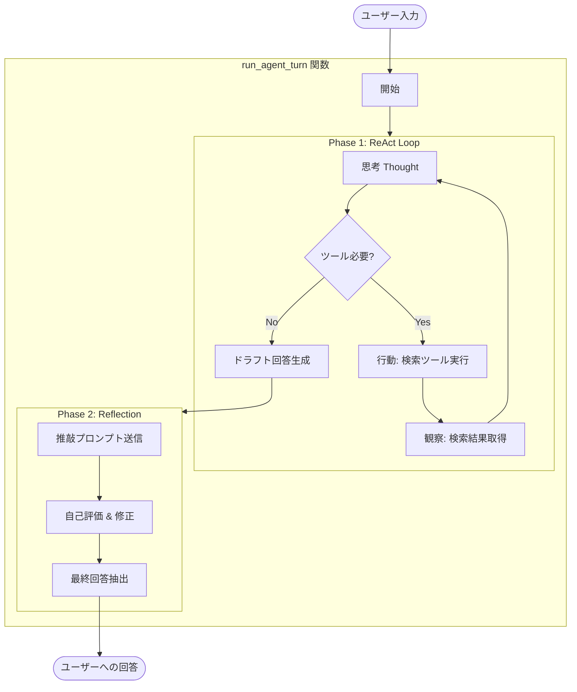
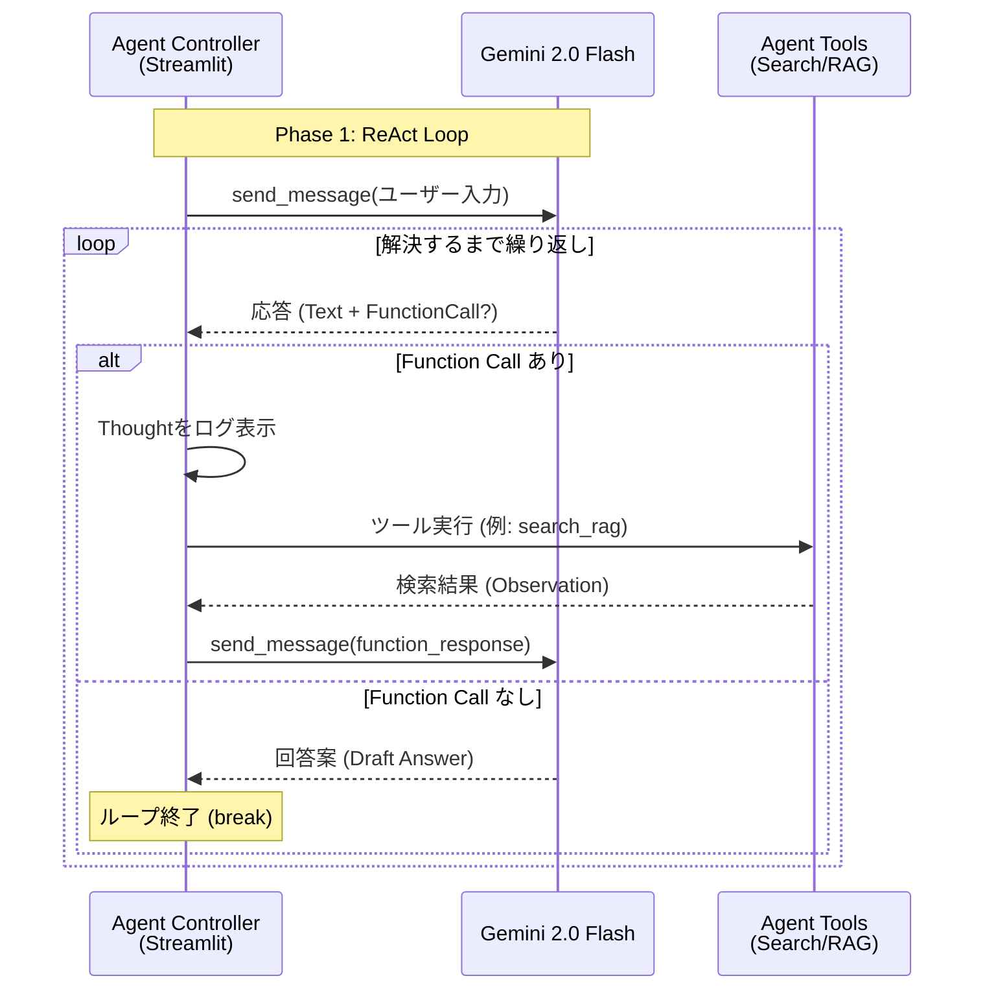
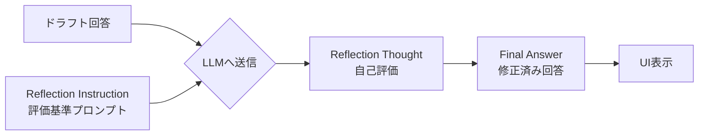
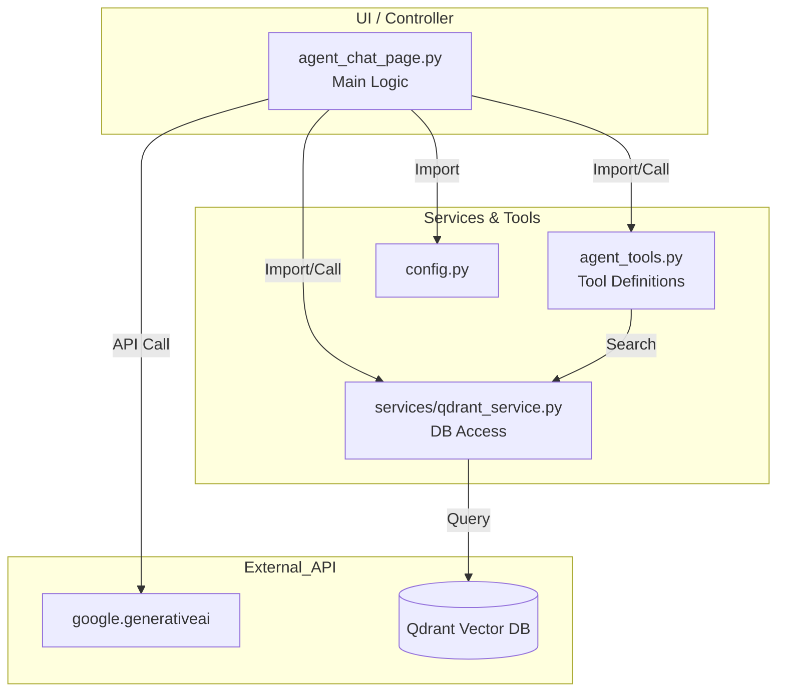

# ReAct + Reflection エージェント実装詳細

`agent_rag.py` (Streamlit UI) における ReAct + Reflection エージェントの実装詳細です。

## 1. 実装概要

本エージェントは、**Gemini 2.0 Flash** を推論エンジンとして使用し、**Qdrant** ベクトルデータベースを外部知識源（ツール）として利用する RAG エージェントです。
主な制御ロジックは `ui/pages/agent_chat_page.py` 内の `run_agent_turn` 関数に集約されています。

### アーキテクチャ全体像
処理は大きく「**Phase 1: ReAct (解決)**」と「**Phase 2: Reflection (推敲)**」の2段階で構成されています。

---

## 2. Phase 1: ReAct (推論と行動) の実装

ユーザーの質問に対し、ツール（検索）が必要か判断し、情報の収集と回答案の作成を行うフェーズです。Gemini API の **Function Calling** 機能を利用し、アプリケーション側で「思考と行動のループ」を制御しています。

### 動作原理とコード対応

*   **実装箇所**: `ui/pages/agent_chat_page.py` -> `run_agent_turn` (後半の `while` ループ)
*   **最大ターン数**: 無限ループ防止のため、`max_turns` (例: 10回) で制限されています。
*   **System Prompt**: `SYSTEM_INSTRUCTION_TEMPLATE` にて、ReAct の思考プロセス（Thought, Action, Observation）を守るよう指示しています。

### 処理シーケンス (Mermaid)

### 主要構成要素

| 項目 | 実装詳細 | 役割 |
| :--- | :--- | :--- |
| **ループ制御** | `while turn_count < max_turns:` | 思考・行動サイクルの維持と無限ループ防止。 |
| **ツール実行** | `part.function_call` 検知 | モデルがツール利用を要求した場合、対応する Python 関数 (`agent_tools.py`) を実行します。 |
| **結果フィードバック** | `chat_session.send_message(...)` | ツールの実行結果を `function_response` としてモデルに返し、次の思考を促します。 |

---

## 3. Phase 2: Reflection (自己省察と推敲) の実装

Phase 1 で生成された「ドラフト回答」に対し、客観的な評価を行い、品質（正確性、スタイル）を高めるフェーズです。

### 動作原理とコード対応

*   **実装箇所**: `ui/pages/agent_chat_page.py` -> `run_agent_turn` (後半の `if final_response_text:` ブロック)
*   **コンテキスト維持**: ReAct と同じ `chat_session` を継続して使用するため、**「どのような検索を経てその回答に至ったか」** という文脈を保持したまま推敲が可能です。

### 推敲プロセス (Mermaid)

### プロンプト戦略 (`REFLECTION_INSTRUCTION`)

`REFLECTION_INSTRUCTION` 定数にて、以下の観点でのチェックを指示しています。

1.  **正確性 (Accuracy)**: 検索結果に基づいているか？ 幻覚 (Hallucination) はないか？
2.  **適切性 (Relevance)**: ユーザーの質問に直接答えているか？
3.  **スタイル (Style)**: 親しみやすく丁寧な日本語（です・ます調）か？ 箇条書き等のフォーマットは適切か？

---

## 4. モジュール構造と依存関係

ReAct + Reflection エージェントを実現するために連携しているファイル群です。

### コンポーネント関連図 (Mermaid)

### モジュール役割定義

| 機能 | 構成要素 (ファイル/クラス/関数) | 役割詳細 |
| :--- | :--- | :--- |
| **Agent Controller** | `ui/pages/agent_chat_page.py` `run_agent_turn` | **司令塔**。ReActループの回転、ツール実行結果のフィードバック、Reflectionフェーズの呼び出し、UIへのログ出力（思考プロセス表示）を一元管理します。 |
| **LLM Interface** | `google.generativeai` `ChatSession` | **脳**。Gemini API とのセッション管理。会話履歴（コンテキスト）を保持し、ReAct から Reflection まで一貫した文脈を提供します。 |
| **Tools Definition** | `agent_tools.py` `search_rag_knowledge_base` | **手足**。エージェントが呼び出し可能な関数定義。`services/qdrant_service.py` などの下位モジュールをラップし、LLM が使いやすいインターフェースを提供します。 |
| **Knowledge Base** | `services/qdrant_service.py` `qdrant_client_wrapper.py` | **記憶**。Qdrant データベースへのアクセス、ベクトル検索（Embedding生成含む）、検索結果のフォーマットを担当します。 |
