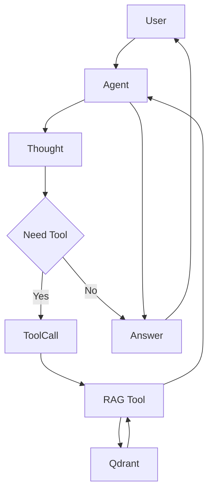

# Gemini3 Hybrid RAG Agent 評価・改善提案書

---

## 1. エグゼクティブサマリー
「自律型 RAG エージェント」、統合管理プラットフォームを公開しました。

フルスクラッチで書かれておりGithubで全ソースを公開中。
エージェント自らが「考える（Reasoning）」と「行動する（Acting）」をCoTでループ
　（ReAct + Reflection） + Qdrantの高速ベクトル検索
[ReAct]：自律的に検索
・プロンプト最適化
　・CoTのループ
　・Hybrid RAG (Dense + Sparse)の検索
・フルスクラッチ実装
・Gemini 3世代対応）です。
[]Reflection]：
・自己評価結果に基づき、最終回答 (Final Answer) を抽出：自己省察
・回答を作成した後、即座に出力せず「自己評価」フェーズを実行し、回答の品質を向上。
・検索結果との整合性やスタイルを自ら批評し、ハルシネーション（幻覚）や誤りを修正しユーザーに回答します。
StreamlitベースのUIを通じて、データの取得・ベクトル化から、Qdrant データベース管理、
そして高度なエージェント対話まで、RAG パイプライン全体を一気通貫で管理・運用することができます。

GitHub:
https://github.com/nakashima2toshio/gemini_agent_rag


ReAct: 自律的に検索
エージェント自らが「考える（Reasoning）」と「行動する（Acting）」をCoTでループ
Router & Multi-turn 戦略で（Thought） → （Action） → （Observation） のループが明確


---

## 2. 現状評価

### 2.1 良い点（評価できるポイント）

#### アーキテクチャ設計
- **ReActパターンの採用**: Thought → Action → Observation のループが明確
- **手動Function Calling**: `enable_automatic_function_calling=False` による制御は学習・デバッグに最適
- **Mermaidによる可視化**: 処理フロー図が分かりやすい



#### 実装面
- **スコアフィルタリング**: ハルシネーション対策として `RAG_SCORE_THRESHOLD` を実装
- **設定の外部化**: `config.py` による閾値・コレクション名の管理
- **ログ機能**: `logs/agent_chat.log` への対話履歴保存
- **CoT可視化**: 思考プロセスの色付き表示

#### プロジェクト管理
- **ToDoリストによる段階的開発**: 優先度と状態が明確
- **Phase管理**: 機能を段階的にリリース

### 2.2 課題・改善が必要な点

#### 評価機能の欠如（最重要）
「評価用サンプルプログラム」と謳っているが、**評価のための仕組み**が不足している。

- テストケースの定義がない
- ルーティング精度の測定手段がない
- 検索精度（Recall@K, MRR等）の計測がない
- レイテンシの記録がない

#### コード品質
- `print` 文と `logger` が混在
- 型ヒントが不完全
- コレクション存在チェックが不十分

#### ドキュメント
- システムプロンプトの具体的な内容が未記載
- テストケース例がない

---

## 3. 改善提案

### 3.1 ディレクトリ構成の拡張

```
gemini3_rag_agent/
├── agent_main.py
├── agent_tools.py
├── config.py
├── logs/
├── ui/
├── eval/                    # 【追加】評価モジュール
│   ├── __init__.py
│   ├── test_cases.json      # テストケース定義
│   ├── evaluator.py         # 自動評価ロジック
│   ├── metrics.py           # 評価指標計算
│   └── report_generator.py  # レポート生成
├── data/                    # 【追加】サンプルデータ
│   └── sample_documents/
├── tests/                   # 【追加】単体テスト
│   ├── test_agent_tools.py
│   └── test_routing.py
└── scripts/                 # 【追加】ユーティリティ
    ├── setup_qdrant.py      # Qdrant初期化
    └── ingest_documents.py  # ドキュメント投入
```

### 3.2 評価指標の定義

| 指標 | 説明 | 目標値 |
|------|------|--------|
| **ルーティング精度** | ツール使用/未使用の判断が正しい割合 | ≥ 90% |
| **コレクション選択精度** | 適切なコレクションを選択した割合 | ≥ 85% |
| **検索精度 (Recall@3)** | 上位3件に正解が含まれる割合 | ≥ 80% |
| **ハルシネーション率** | 検索結果なしで回答を創作した割合 | 0% |
| **平均レイテンシ** | 検索実行時間 | ≤ 500ms |

### 3.3 システムプロンプトの具体化

```python
SYSTEM_INSTRUCTION = """
あなたは社内ナレッジを検索するアシスタントです。

## 判断基準
以下に該当する場合は `search_rag_knowledge_base` ツールを使用してください：
- プロジェクト固有の仕様・設定に関する質問
- 社内ドキュメント・手順書への参照が必要な質問
- エラーメッセージの解決方法
- 「〜の仕様は？」「〜の設定値は？」という形式の質問

以下の場合はツールを使用せず直接回答してください：
- 一般的なプログラミング知識（Pythonの文法など）
- 挨拶・雑談
- 計算・変換
- 一般常識で答えられる質問

## コレクション選択
利用可能なコレクション:
- `internal_docs`: 社内技術ドキュメント
- `company_rules`: 就業規則・社内規定
- `qa_pairs`: よくある質問と回答

質問内容に最も適切なコレクションを選択してください。

## 検索結果がない場合
「申し訳ありませんが、関連する情報が見つかりませんでした」と正直に回答してください。
**推測や創作は絶対に行わないでください。**

## 回答形式
1. まず思考プロセスを "Thought:" で始めて説明
2. ツールを使用する場合は適切なパラメータで呼び出し
3. 検索結果に基づいて簡潔に回答
"""
```

### 3.4 エラーハンドリングの強化

```python
class RAGToolError(Exception):
    """RAGツール固有のエラー基底クラス"""
    pass

class QdrantConnectionError(RAGToolError):
    """Qdrant接続エラー"""
    pass

class CollectionNotFoundError(RAGToolError):
    """コレクション未存在エラー"""
    pass

class EmbeddingError(RAGToolError):
    """埋め込み生成エラー"""
    pass
```

---

## 4. 改善版コード

### 4.1 agent_tools.py（改善版）

```python
# agent_tools.py (Improved Version)
"""
RAGエージェント用ツール定義
- 検索機能
- メトリクス収集
- エラーハンドリング
"""

import os
import time
import logging
from typing import Optional, List
from dataclasses import dataclass, field

from qdrant_client import QdrantClient
from qdrant_client.http.exceptions import UnexpectedResponse
from qdrant_client_wrapper import search_collection, embed_query, QDRANT_CONFIG
from config import AgentConfig

logger = logging.getLogger(__name__)

# Initialize Client
qdrant_url = QDRANT_CONFIG.get("url", "http://localhost:6333")
client = QdrantClient(url=qdrant_url)


# ============ カスタム例外 ============
class RAGToolError(Exception):
    """RAGツール固有のエラー基底クラス"""
    pass

class QdrantConnectionError(RAGToolError):
    """Qdrant接続エラー"""
    pass

class CollectionNotFoundError(RAGToolError):
    """コレクション未存在エラー"""
    pass


# ============ 評価用メトリクス ============
@dataclass
class SearchMetrics:
    """検索結果のメトリクス（評価用）"""
    query: str
    collection_name: str
    latency_ms: float
    total_results: int
    filtered_results: int
    top_score: float
    scores: List[float] = field(default_factory=list)
    error: Optional[str] = None
    timestamp: str = field(default_factory=lambda: time.strftime("%Y-%m-%d %H:%M:%S"))

_search_metrics_log: List[SearchMetrics] = []

def get_search_metrics() -> List[SearchMetrics]:
    """評価用: 収集したメトリクスを取得"""
    return _search_metrics_log.copy()

def clear_search_metrics() -> None:
    """評価用: メトリクスをクリア"""
    _search_metrics_log.clear()

def export_metrics_to_dict() -> List[dict]:
    """メトリクスを辞書形式でエクスポート"""
    from dataclasses import asdict
    return [asdict(m) for m in _search_metrics_log]


# ============ ヘルスチェック ============
def check_qdrant_health() -> bool:
    """Qdrantサーバーの接続確認"""
    try:
        client.get_collections()
        logger.info("Qdrant health check: OK")
        return True
    except Exception as e:
        logger.error(f"Qdrant health check failed: {e}")
        return False


# ============ ツール関数 ============
def list_rag_collections() -> str:
    """
    利用可能なRAGのコレクション一覧（ナレッジベースの種類）を取得します。
    ユーザーが「どのような知識があるか」「コレクション一覧を教えて」と質問した場合に使用してください。

    Returns:
        str: 利用可能なコレクション名のリスト。
    """
    logger.info("コレクション一覧を取得中...")
    try:
        collections_response = client.get_collections()
        collections = [c.name for c in collections_response.collections]

        if not collections:
            return "現在、利用可能なコレクションはありません。"

        # コレクションごとのドキュメント数も表示
        result_lines = ["利用可能なコレクション一覧:"]
        for c in collections:
            try:
                info = client.get_collection(c)
                count = info.points_count
                result_lines.append(f"- {c} ({count} documents)")
            except Exception:
                result_lines.append(f"- {c}")

        logger.info(f"コレクション一覧取得完了: {len(collections)}件")
        return "\n".join(result_lines)

    except Exception as e:
        logger.error(f"コレクション一覧取得エラー: {e}")
        return f"コレクション一覧の取得中にエラーが発生しました: {str(e)}"


def search_rag_knowledge_base(
    query: str,
    collection_name: Optional[str] = None
) -> str:
    """
    Qdrantデータベースから専門的な知識を検索します。
    ユーザーが「仕様」「設定」「Wikipediaの知識」「事実確認」など、
    外部知識が必要な詳細について質問した場合にこのツールを使用してください。

    一般的な挨拶（「こんにちは」など）や、単純な計算、
    一般的なプログラミングの文法質問には使用しないでください。

    Args:
        query: 検索したいキーワードや質問文。
        collection_name: 検索対象のQdrantコレクション名。
                        指定しない場合、デフォルトコレクションが使用されます。
    Returns:
        str: 検索されたドキュメントの内容（質問と回答のペア）。
    """
    if collection_name is None:
        collection_name = AgentConfig.RAG_DEFAULT_COLLECTION

    start_time = time.time()
    logger.info(f"RAG検索を実行: query='{query}', collection='{collection_name}'")

    # メトリクス初期化
    metrics = SearchMetrics(
        query=query,
        collection_name=collection_name,
        latency_ms=0,
        total_results=0,
        filtered_results=0,
        top_score=0.0
    )

    try:
        # コレクション存在チェック
        existing_collections = [c.name for c in client.get_collections().collections]
        if collection_name not in existing_collections:
            error_msg = f"エラー: コレクション '{collection_name}' は存在しません。利用可能: {existing_collections}"
            logger.warning(error_msg)
            metrics.error = error_msg
            metrics.latency_ms = (time.time() - start_time) * 1000
            _search_metrics_log.append(metrics)
            return error_msg

        # 1. クエリの埋め込み生成
        query_vector = embed_query(query)

        # 2. Qdrant検索実行
        results = search_collection(
            client=client,
            collection_name=collection_name,
            query_vector=query_vector,
            limit=AgentConfig.RAG_SEARCH_LIMIT
        )

        metrics.total_results = len(results) if results else 0

        if not results:
            metrics.latency_ms = (time.time() - start_time) * 1000
            _search_metrics_log.append(metrics)
            logger.info("検索結果: 0件")
            return "検索結果が見つかりませんでした。"

        # 3. スコア収集 & フィルタリング
        scores = [res.get("score", 0.0) for res in results]
        metrics.scores = scores
        metrics.top_score = max(scores) if scores else 0.0

        # 4. 結果の整形
        formatted_results = []
        for i, res in enumerate(results, 1):
            score = res.get("score", 0.0)

            # スコア閾値によるフィルタリング
            if score < AgentConfig.RAG_SCORE_THRESHOLD:
                continue

            payload = res.get("payload", {})
            q = payload.get("question", "N/A")
            a = payload.get("answer", "N/A")
            source = payload.get("source", "unknown")

            formatted_results.append(
                f"Result {i} (Score: {score:.2f}):\n"
                f"Q: {q}\n"
                f"A: {a}\n"
                f"Source: {source}"
            )

        # メトリクス記録
        metrics.filtered_results = len(formatted_results)
        metrics.latency_ms = (time.time() - start_time) * 1000
        _search_metrics_log.append(metrics)

        logger.info(
            f"検索完了: {metrics.filtered_results}/{metrics.total_results} results, "
            f"top_score={metrics.top_score:.2f}, latency={metrics.latency_ms:.1f}ms"
        )

        if not formatted_results:
            return "検索結果は見つかりましたが、関連性スコアが低いため採用しませんでした。"

        return "\n".join(formatted_results)

    except UnexpectedResponse as e:
        error_msg = f"Qdrantサーバーエラー: {str(e)}"
        logger.error(error_msg)
        metrics.error = error_msg
        metrics.latency_ms = (time.time() - start_time) * 1000
        _search_metrics_log.append(metrics)
        return error_msg

    except Exception as e:
        error_msg = f"検索中にエラーが発生しました: {str(e)}"
        logger.error(error_msg, exc_info=True)
        metrics.error = error_msg
        metrics.latency_ms = (time.time() - start_time) * 1000
        _search_metrics_log.append(metrics)
        return error_msg


# ============ ツール定義（Gemini Function Calling用） ============
TOOLS_DEFINITION = [
    {
        "name": "list_rag_collections",
        "description": list_rag_collections.__doc__,
        "parameters": {
            "type": "object",
            "properties": {},
            "required": []
        }
    },
    {
        "name": "search_rag_knowledge_base",
        "description": search_rag_knowledge_base.__doc__,
        "parameters": {
            "type": "object",
            "properties": {
                "query": {
                    "type": "string",
                    "description": "検索したいキーワードや質問文"
                },
                "collection_name": {
                    "type": "string",
                    "description": "検索対象のQdrantコレクション名（省略時はデフォルト）"
                }
            },
            "required": ["query"]
        }
    }
]

# ツール名から関数へのマッピング
TOOLS_MAP = {
    "list_rag_collections": list_rag_collections,
    "search_rag_knowledge_base": search_rag_knowledge_base,
}
```

### 4.2 config.py（追加設定例）

```python
# config.py (追加設定)

from dataclasses import dataclass
from typing import List
import os

@dataclass
class AgentConfig:
    """エージェント設定"""
    # RAG設定
    RAG_DEFAULT_COLLECTION: str = "qa_pairs"
    RAG_AVAILABLE_COLLECTIONS: List[str] = None
    RAG_SCORE_THRESHOLD: float = 0.7
    RAG_SEARCH_LIMIT: int = 5

    # モデル設定
    MODEL_NAME: str = "gemini-2.0-flash"
    MAX_OUTPUT_TOKENS: int = 2048
    TEMPERATURE: float = 0.3

    # 評価設定
    EVAL_ENABLED: bool = True
    EVAL_LOG_METRICS: bool = True

    def __post_init__(self):
        if self.RAG_AVAILABLE_COLLECTIONS is None:
            self.RAG_AVAILABLE_COLLECTIONS = [
                "qa_pairs",
                "internal_docs",
                "company_rules"
            ]

@dataclass
class PathConfig:
    """パス設定"""
    LOG_DIR: str = "logs"
    LOG_FILE: str = "agent_chat.log"
    EVAL_OUTPUT_DIR: str = "eval/results"

    def __post_init__(self):
        os.makedirs(self.LOG_DIR, exist_ok=True)
        os.makedirs(self.EVAL_OUTPUT_DIR, exist_ok=True)
```

---

## 5. 評価フレームワーク

### 5.1 テストケース定義（eval/test_cases.json）

```json
{
  "version": "1.0",
  "description": "Gemini3 RAG Agent 評価用テストケース",
  "test_cases": [
    {
      "id": "TC001",
      "category": "tool_routing",
      "subcategory": "no_tool",
      "input": "こんにちは",
      "expected_tool_use": false,
      "expected_collection": null,
      "description": "挨拶 → ツール不要"
    },
    {
      "id": "TC002",
      "category": "tool_routing",
      "subcategory": "no_tool",
      "input": "Pythonでリストをソートする方法は？",
      "expected_tool_use": false,
      "expected_collection": null,
      "description": "一般的なプログラミング知識 → ツール不要"
    },
    {
      "id": "TC003",
      "category": "tool_routing",
      "subcategory": "no_tool",
      "input": "3 + 5 は？",
      "expected_tool_use": false,
      "expected_collection": null,
      "description": "計算 → ツール不要"
    },
    {
      "id": "TC004",
      "category": "tool_routing",
      "subcategory": "tool_required",
      "input": "プロジェクトのAPI仕様を教えて",
      "expected_tool_use": true,
      "expected_collection": "internal_docs",
      "description": "社内情報 → RAG必須"
    },
    {
      "id": "TC005",
      "category": "tool_routing",
      "subcategory": "tool_required",
      "input": "設定ファイルのパスはどこ？",
      "expected_tool_use": true,
      "expected_collection": "internal_docs",
      "description": "プロジェクト固有情報 → RAG必須"
    },
    {
      "id": "TC006",
      "category": "collection_selection",
      "subcategory": "company_rules",
      "input": "有給休暇の申請方法は？",
      "expected_tool_use": true,
      "expected_collection": "company_rules",
      "description": "就業規則 → company_rulesコレクション"
    },
    {
      "id": "TC007",
      "category": "collection_selection",
      "subcategory": "qa_pairs",
      "input": "よくあるエラーの対処法は？",
      "expected_tool_use": true,
      "expected_collection": "qa_pairs",
      "description": "FAQ → qa_pairsコレクション"
    },
    {
      "id": "TC008",
      "category": "hallucination",
      "subcategory": "unknown_info",
      "input": "存在しないモジュールABC123の設定方法は？",
      "expected_tool_use": true,
      "expected_behavior": "not_found_response",
      "description": "未知情報 → 検索後「見つからない」と回答すべき"
    },
    {
      "id": "TC009",
      "category": "hallucination",
      "subcategory": "low_score",
      "input": "全く関係ない宇宙の話をして",
      "expected_tool_use": false,
      "expected_behavior": "direct_response",
      "description": "関係ない話題 → ツール不要で直接回答"
    },
    {
      "id": "TC010",
      "category": "collection_listing",
      "subcategory": "list_collections",
      "input": "どのようなナレッジがありますか？",
      "expected_tool_use": true,
      "expected_tool_name": "list_rag_collections",
      "description": "コレクション一覧要求 → list_rag_collectionsツール"
    }
  ]
}
```

### 5.2 評価スクリプト（eval/evaluator.py）

```python
# eval/evaluator.py
"""
エージェント評価フレームワーク
"""
import json
import time
from pathlib import Path
from typing import List, Dict, Any, Optional
from dataclasses import dataclass, asdict
import logging

logger = logging.getLogger(__name__)


@dataclass
class TestCase:
    """テストケース定義"""
    id: str
    category: str
    input: str
    expected_tool_use: bool
    subcategory: str = ""
    expected_collection: Optional[str] = None
    expected_tool_name: Optional[str] = None
    expected_behavior: Optional[str] = None
    expected_keywords: Optional[List[str]] = None
    description: str = ""


@dataclass
class TestResult:
    """テスト結果"""
    test_case_id: str
    category: str
    input: str
    actual_tool_used: bool
    actual_tool_name: Optional[str] = None
    actual_collection: Optional[str] = None
    response: str = ""
    latency_ms: float = 0.0
    top_score: float = 0.0
    passed: bool = False
    failure_reason: str = ""
    timestamp: str = ""


def load_test_cases(path: str = "eval/test_cases.json") -> List[TestCase]:
    """テストケースをJSONから読み込み"""
    with open(path, "r", encoding="utf-8") as f:
        data = json.load(f)
    return [TestCase(**tc) for tc in data["test_cases"]]


def evaluate_routing(test_case: TestCase, actual_tool_used: bool) -> tuple:
    """ルーティング判断の評価"""
    if test_case.expected_tool_use == actual_tool_used:
        return True, ""
    else:
        return False, f"Expected tool_use={test_case.expected_tool_use}, got {actual_tool_used}"


def evaluate_collection_selection(
    test_case: TestCase,
    actual_collection: Optional[str]
) -> tuple:
    """コレクション選択の評価"""
    if test_case.expected_collection is None:
        return True, ""
    if test_case.expected_collection == actual_collection:
        return True, ""
    return False, f"Expected collection='{test_case.expected_collection}', got '{actual_collection}'"


def evaluate_tool_name(
    test_case: TestCase,
    actual_tool_name: Optional[str]
) -> tuple:
    """ツール名の評価"""
    if test_case.expected_tool_name is None:
        return True, ""
    if test_case.expected_tool_name == actual_tool_name:
        return True, ""
    return False, f"Expected tool='{test_case.expected_tool_name}', got '{actual_tool_name}'"


def evaluate_hallucination(
    test_case: TestCase,
    response: str,
    search_results_found: bool
) -> tuple:
    """ハルシネーション評価"""
    if test_case.expected_behavior != "not_found_response":
        return True, ""

    # 「見つからない」系のキーワードチェック
    not_found_keywords = [
        "見つかりませんでした",
        "情報がありません",
        "該当する結果がありません",
        "関連性スコアが低い"
    ]

    if not search_results_found:
        for keyword in not_found_keywords:
            if keyword in response:
                return True, ""
        return False, "検索結果なしでもハルシネーション応答の可能性"

    return True, ""


def run_single_test(
    test_case: TestCase,
    agent_func,  # エージェント実行関数
    get_metrics_func  # メトリクス取得関数
) -> TestResult:
    """単一テストの実行"""
    start_time = time.time()

    result = TestResult(
        test_case_id=test_case.id,
        category=test_case.category,
        input=test_case.input,
        actual_tool_used=False,
        timestamp=time.strftime("%Y-%m-%d %H:%M:%S")
    )

    try:
        # エージェント実行
        response, tool_info = agent_func(test_case.input)

        result.response = response
        result.actual_tool_used = tool_info.get("tool_used", False)
        result.actual_tool_name = tool_info.get("tool_name")
        result.actual_collection = tool_info.get("collection_name")
        result.latency_ms = (time.time() - start_time) * 1000

        # メトリクス取得
        metrics = get_metrics_func()
        if metrics:
            latest = metrics[-1]
            result.top_score = latest.top_score

        # 評価実行
        failures = []

        # ルーティング評価
        passed, reason = evaluate_routing(test_case, result.actual_tool_used)
        if not passed:
            failures.append(reason)

        # コレクション選択評価
        passed, reason = evaluate_collection_selection(test_case, result.actual_collection)
        if not passed:
            failures.append(reason)

        # ツール名評価
        passed, reason = evaluate_tool_name(test_case, result.actual_tool_name)
        if not passed:
            failures.append(reason)

        # ハルシネーション評価
        search_found = result.top_score > 0
        passed, reason = evaluate_hallucination(test_case, response, search_found)
        if not passed:
            failures.append(reason)

        result.passed = len(failures) == 0
        result.failure_reason = "; ".join(failures)

    except Exception as e:
        result.failure_reason = f"Exception: {str(e)}"
        result.passed = False
        logger.error(f"Test {test_case.id} failed with exception: {e}")

    return result


def generate_report(results: List[TestResult]) -> Dict[str, Any]:
    """評価レポート生成"""
    total = len(results)
    passed = sum(1 for r in results if r.passed)

    # カテゴリ別集計
    by_category = {}
    for r in results:
        cat = r.category
        if cat not in by_category:
            by_category[cat] = {"total": 0, "passed": 0, "failed_ids": []}
        by_category[cat]["total"] += 1
        if r.passed:
            by_category[cat]["passed"] += 1
        else:
            by_category[cat]["failed_ids"].append(r.test_case_id)

    # カテゴリ別精度計算
    for cat in by_category:
        by_category[cat]["accuracy"] = (
            by_category[cat]["passed"] / by_category[cat]["total"]
            if by_category[cat]["total"] > 0 else 0
        )

    # レイテンシ統計
    latencies = [r.latency_ms for r in results if r.latency_ms > 0]
    avg_latency = sum(latencies) / len(latencies) if latencies else 0

    return {
        "summary": {
            "total_cases": total,
            "passed": passed,
            "failed": total - passed,
            "accuracy": passed / total if total > 0 else 0,
            "timestamp": time.strftime("%Y-%m-%d %H:%M:%S")
        },
        "by_category": by_category,
        "performance": {
            "avg_latency_ms": round(avg_latency, 2),
            "max_latency_ms": round(max(latencies), 2) if latencies else 0,
            "min_latency_ms": round(min(latencies), 2) if latencies else 0
        },
        "failed_cases": [
            {
                "id": r.test_case_id,
                "input": r.input,
                "reason": r.failure_reason
            }
            for r in results if not r.passed
        ]
    }


def save_report(report: Dict[str, Any], output_path: str = "eval/results/report.json"):
    """レポートをJSONファイルに保存"""
    Path(output_path).parent.mkdir(parents=True, exist_ok=True)
    with open(output_path, "w", encoding="utf-8") as f:
        json.dump(report, f, ensure_ascii=False, indent=2)
    logger.info(f"Report saved to {output_path}")


def print_report_summary(report: Dict[str, Any]):
    """レポートサマリーをコンソール出力"""
    print("\n" + "="*60)
    print("📊 評価レポート サマリー")
    print("="*60)

    s = report["summary"]
    print(f"\n【全体結果】")
    print(f"  総テストケース: {s['total_cases']}")
    print(f"  成功: {s['passed']} / 失敗: {s['failed']}")
    print(f"  精度: {s['accuracy']*100:.1f}%")

    print(f"\n【カテゴリ別】")
    for cat, data in report["by_category"].items():
        status = "✅" if data["accuracy"] >= 0.9 else "⚠️" if data["accuracy"] >= 0.7 else "❌"
        print(f"  {status} {cat}: {data['accuracy']*100:.1f}% ({data['passed']}/{data['total']})")

    print(f"\n【パフォーマンス】")
    p = report["performance"]
    print(f"  平均レイテンシ: {p['avg_latency_ms']}ms")
    print(f"  最大: {p['max_latency_ms']}ms / 最小: {p['min_latency_ms']}ms")

    if report["failed_cases"]:
        print(f"\n【失敗ケース詳細】")
        for fc in report["failed_cases"]:
            print(f"  ❌ {fc['id']}: {fc['reason']}")

    print("\n" + "="*60)
```

### 5.3 評価実行スクリプト（eval/run_evaluation.py）

```python
# eval/run_evaluation.py
"""
評価実行スクリプト
Usage: python -m eval.run_evaluation
"""
import sys
import logging
from pathlib import Path

# プロジェクトルートをパスに追加
sys.path.insert(0, str(Path(__file__).parent.parent))

from eval.evaluator import (
    load_test_cases,
    run_single_test,
    generate_report,
    save_report,
    print_report_summary
)
from agent_tools import get_search_metrics, clear_search_metrics

logging.basicConfig(
    level=logging.INFO,
    format='%(asctime)s - %(name)s - %(levelname)s - %(message)s'
)
logger = logging.getLogger(__name__)


def mock_agent_func(user_input: str) -> tuple:
    """
    エージェント実行関数（実装時に置き換え）

    Returns:
        tuple: (response_text, tool_info_dict)
    """
    # TODO: 実際のエージェント呼び出しに置き換え
    # from agent_main import run_agent_turn
    # return run_agent_turn(user_input)

    # モック実装
    tool_info = {
        "tool_used": False,
        "tool_name": None,
        "collection_name": None
    }

    # 簡易ルーティング判定（テスト用）
    tool_keywords = ["仕様", "設定", "ナレッジ", "コレクション", "API", "規則"]
    if any(kw in user_input for kw in tool_keywords):
        tool_info["tool_used"] = True
        tool_info["tool_name"] = "search_rag_knowledge_base"
        tool_info["collection_name"] = "internal_docs"

    return f"Response to: {user_input}", tool_info


def main():
    """評価メイン処理"""
    logger.info("評価開始")

    # テストケース読み込み
    test_cases = load_test_cases("eval/test_cases.json")
    logger.info(f"テストケース数: {len(test_cases)}")

    # メトリクスクリア
    clear_search_metrics()

    # テスト実行
    results = []
    for tc in test_cases:
        logger.info(f"Running: {tc.id} - {tc.description}")
        result = run_single_test(tc, mock_agent_func, get_search_metrics)
        results.append(result)

        status = "✅" if result.passed else "❌"
        logger.info(f"  {status} {tc.id}: {result.failure_reason or 'OK'}")

    # レポート生成
    report = generate_report(results)

    # 保存 & 出力
    save_report(report)
    print_report_summary(report)

    # 終了コード（CI用）
    if report["summary"]["accuracy"] < 0.9:
        logger.warning("精度が90%未満です")
        sys.exit(1)

    logger.info("評価完了")


if __name__ == "__main__":
    main()
```

---

## 6. Phase 3 ロードマップ

### 6.1 優先度別タスク

| No. | 領域 | タスク名 | 詳細・目的 | 優先度 | 工数 |
|-----|------|----------|------------|--------|------|
| 1 | **評価** | 評価フレームワーク構築 | `eval/` ディレクトリの実装 | **高** | 2日 |
| 2 | **評価** | テストケース作成（20件以上） | ルーティング・検索精度の検証 | **高** | 1日 |
| 3 | **品質** | ロギング統一 | print → logger | 中 | 0.5日 |
| 4 | **品質** | 型ヒント完全化 | mypy対応 | 中 | 0.5日 |
| 5 | **CI/CD** | GitHub Actions統合 | pytest + 評価自動実行 | 中 | 1日 |
| 6 | **UX** | Streamlit評価ダッシュボード | 結果の可視化 | 中 | 2日 |
| 7 | **機能** | マルチツール対応 | Web検索、計算ツール追加 | 低 | 3日 |
| 8 | **機能** | 会話コンテキスト管理改善 | Redis活用 | 低 | 2日 |

### 6.2 マイルストーン

```
Phase 3.1 (1週間)
├── 評価フレームワーク実装
├── テストケース20件作成
└── 初回ベースライン測定

Phase 3.2 (1週間)
├── CI/CD統合
├── ロギング・型ヒント改善
└── Streamlitダッシュボード

Phase 3.3 (2週間)
├── マルチツール対応
├── 本番データでの評価
└── ドキュメント整備・公開準備
```

### 6.3 評価サイクル

```
┌─────────────┐
│ ベースライン │
│   測定      │
└─────┬───────┘
      │
      ▼
┌─────────────┐
│  弱点特定   │◄─────────────┐
│ （失敗分析）│              │
└─────┬───────┘              │
      │                      │
      ▼                      │
┌─────────────┐              │
│  改善実施   │              │
│ ・プロンプト│              │
│ ・閾値調整  │              │
│ ・データ追加│              │
└─────┬───────┘              │
      │                      │
      ▼                      │
┌─────────────┐              │
│  再評価    │───────────────┘
│ （効果確認）│
└─────────────┘
```

---

## 7. 付録

### 7.1 参考リンク

- [Google Gemini Function Calling](https://cloud.google.com/vertex-ai/generative-ai/docs/multimodal/function-calling)
- [Qdrant Documentation](https://qdrant.tech/documentation/)
- [ReAct: Synergizing Reasoning and Acting (論文)](https://arxiv.org/abs/2210.03629)

### 7.2 環境構築チェックリスト

```bash
# 1. Python環境
python --version  # 3.10+

# 2. 依存関係インストール
pip install google-generativeai qdrant-client python-dotenv

# 3. Qdrant起動（Docker）
docker-compose up -d qdrant

# 4. 環境変数設定
cp .env.example .env
# GEMINI_API_KEY, QDRANT_HOST, QDRANT_PORT を設定

# 5. 動作確認
python agent_main.py
```

### 7.3 よくある問題と対処

| 問題 | 原因 | 対処 |
|------|------|------|
| Qdrant接続エラー | Dockerが起動していない | `docker-compose up -d` |
| API Key エラー | 環境変数未設定 | `.env` ファイル確認 |
| 検索結果なし | コレクションが空 | サンプルデータ投入 |
| スコアが常に低い | 閾値が高すぎる | `RAG_SCORE_THRESHOLD` 調整 |

---

**Document Version:** 1.0
**Last Updated:** 2025/12/05
**Author:** Claude (Anthropic)