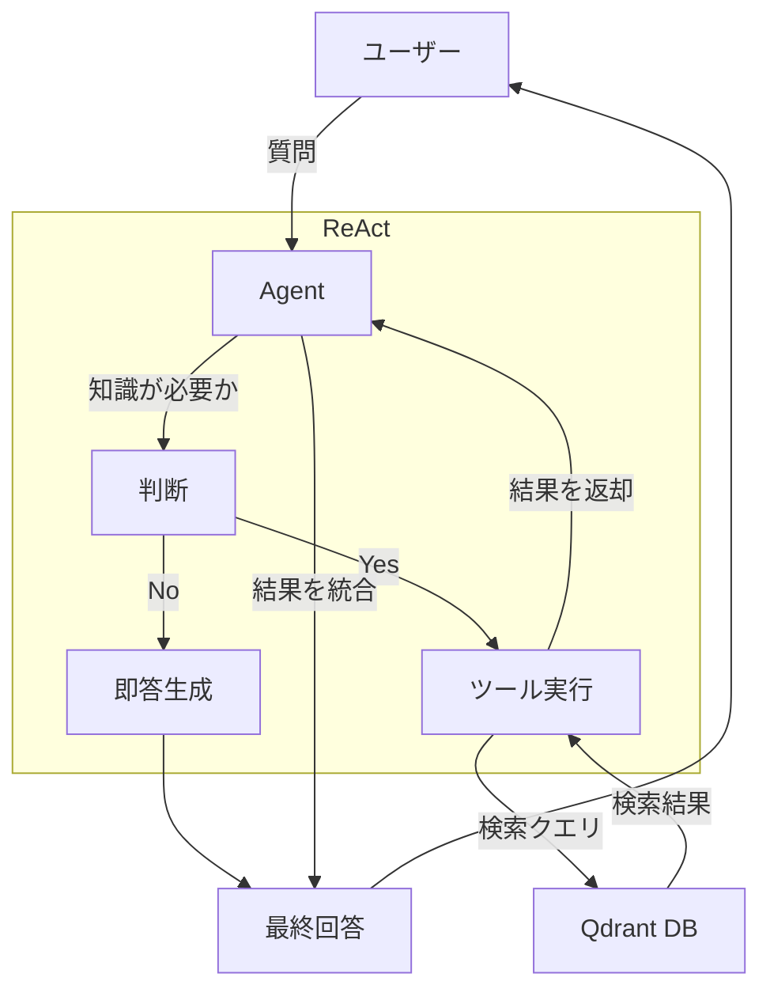

# ハイブリッド・ナレッジ・エージェント 仕様概要書

プロジェクト名:Gemini3 Hybrid RAG Agent

作成日: 2025/12/04

対象環境: macOS (M2), Python 3.x, PyCharm, Qdrant (Local)

1. 開発目的
   既存のRAGシステム（知識検索）を、AIエージェントの「道具（Tool）」として統合する。 これにより、AIがユーザーの質問意図を自律的に解釈し、「一般的な会話」と「専門知識の検索」を使い分けるReAct（Reasoning + Acting）型システムを構築する。
2. システムアーキテクチャ概要
   本システムは、「脳（Gemini 1.5 Pro）」と「道具（RAG検索関数）」で構成される。

Front-end: Python CLI (Command Line Interface) - PyCharmのターミナルで動作
Brain (LLM): Google Gemini 1.5 Pro (Function Calling対応)
Knowledge Base: Qdrant Vector Database (既存資産を活用)
Embedding: Gemini Embedding Model (text-embedding-004)

処理フロー図

3. 機能要件
   3.1. 対話機能 (Chat)
   ユーザーからの自然言語入力を受け付ける。

文脈（以前のやり取り）を保持し、マルチターン会話が可能。

3.2. 自律判断機能 (Router)
ユーザーの入力内容に基づき、外部ツール（RAG）を使用すべきか判断する。

判断基準:

ツール使用: プロジェクト固有の仕様、設定値、エラー内容、社内ドキュメントに関する質問。

ツール未使用: 挨拶、一般的なPythonの文法質問、雑談、計算など。

3.3. 情報検索機能 (RAG Tool)
ツール名: search_rag_knowledge_base

入力: 検索クエリ（文字列）

処理:

1. クエリをベクトル化 (text-embedding-004)。

2. Qdrantの既存コレクション (gemini_rag_collection) を検索。

3. 上位（Top-k）の検索結果から question と answer を抽出。

　　出力: 検索結果を整形したテキストデータ。

4. 構成定義
   4.1. ディレクトリ構成
   既存の gemini3_rag_agent プロジェクト直下に以下を配置する。
   gemini3_rag_agent/
   ├── agent_main.py       # 【新規】エージェント実行のエントリーポイント（脳）
   ├── agent_tools.py      # 【新規】RAG検索ロジックをカプセル化したツール定義
   ├── rag_qa_pair_qdrant.py # 【既存】参照用（ここからロジックを流用）
   └── ui/                 # 【既存】Streamlit用コード（今回は使用しない）

4.2. 環境変数
.env ファイルまたは環境変数として以下が必要。

GEMINI_API_KEY: Gemini API利用キー

QDRANT_HOST: Qdrantサーバーのアドレス (default: localhost)

QDRANT_PORT: ポート番号 (default: 6333)

5. 評価・ゴール設定 (Acceptance Criteria)
   以下の挙動が確認できた時点で「中級編：完成」とする。

一般会話: * User: "Pythonでリストの長さを取得するには？"

Agent: (ツールを使わず即答) "len() 関数を使います..."

RAG検索: * User: "Qdrantの接続ポートは何番になってる？"

Agent: (ツール search_rag_knowledge_base を自律的に実行)

Output: (DBから検索した情報を元に) "6333番ポートを使用する設定になっています..."

複合: * 検索結果が見つからない場合、「情報が見つかりませんでした」と正直に答えられること。
