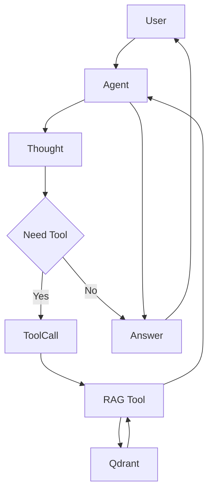

# ハイブリッド・ナレッジ・エージェント 仕様概要書・案

プロジェクト名:Gemini3 Hybrid RAG Agent

作成日: 2025/12/04
更新日: 2025/12/05 (Phase 2.3: 動的コレクション選択)

対象環境: macOS (M2), Python 3.x, PyCharm, Qdrant (Local)

1. 開発目的
   既存のRAGシステム（知識検索）を、AIエージェントの「道具（Tool）」として統合する。 これにより、AIがユーザーの質問意図を自律的に解釈し、「一般的な会話」と「専門知識の検索」を使い分けるReAct（Reasoning + Acting）型システムを構築する。
2. システムアーキテクチャ概要
   本システムは、「脳（Gemini 1.5 Pro/2.0 Flash）」と「道具（RAG検索関数）」で構成される。

Front-end: Python CLI (Command Line Interface) - PyCharmのターミナルで動作
Brain (LLM): Google Gemini 2.0 Flash (Manual Function Calling + System Instruction)
Knowledge Base: Qdrant Vector Database (既存資産を活用)
Embedding: Gemini Embedding Model (text-embedding-004)

処理フロー図



3. 機能要件
   3.1. 対話機能 (Chat)
   ユーザーからの自然言語入力を受け付ける。
   文脈（以前のやり取り）を保持し、マルチターン会話が可能。
   **対話履歴は自動的にログファイル（`logs/agent_chat.log`）に保存される。**

   3.2. 自律判断機能 (Router & CoT)
   ユーザーの入力内容に基づき、外部ツール（RAG）を使用すべきか判断する。
   **思考プロセス (Chain of Thought) を可視化し、ユーザーに「なぜその行動をとったか」を明示する。**
   **利用可能な複数のQdrantコレクションから、質問内容に応じて適切なコレクションを検索対象として選択できる。**

   判断基準:
   *   ツール使用: プロジェクト固有の仕様、設定値、エラー内容、社内ドキュメントに関する質問。
   *   ツール未使用: 挨拶、一般的なPythonの文法質問、雑談、計算など。

   3.3. 情報検索機能 (RAG Tool)
   ツール名: search_rag_knowledge_base
   入力: 検索クエリ（文字列）, **collection_name (文字列, オプション)**
   処理:
    1. クエリをベクトル化 (text-embedding-004)。
    2. **指定されたコレクション名（またはデフォルトコレクション）** をQdrantで検索。
    3. **スコアフィルタリング:** 類似度スコアが閾値（例: 0.7）未満の結果は除外する。
   出力: 検索結果を整形したテキストデータ。または「結果なし」メッセージ。

4. 構成定義
   4.1. ディレクトリ構成
   gemini3_rag_agent/
   ├── agent_main.py       # エージェント実行エントリーポイント (ReAct Loop実装, システムプロンプト更新)
   ├── agent_tools.py      # RAG検索ツール定義 (コレクション名引数対応, スコアフィルタリング付き)
   ├── config.py           # 設定管理 (AgentConfig, PathConfigにロギング設定追加, **RAG_AVAILABLE_COLLECTIONS追加**)
   ├── rag_qa_pair_qdrant.py # 【既存】参照用
   ├── logs/               # 対話履歴ログなどを保存 (config.pyで設定)
   └── ui/                 # 【既存】Streamlit用コード

4.2. 環境変数
.env ファイルまたは環境変数として以下が必要。
GEMINI_API_KEY: Gemini API利用キー
QDRANT_HOST: Qdrantサーバーのアドレス (default: localhost)
QDRANT_PORT: ポート番号 (default: 6333)

5. 評価・ゴール設定 (Acceptance Criteria)
   
   **[Phase 2 完了基準]**
   
   *   **可視化:** エージェントの思考 `[🧠 Thought]` とツール実行 `[🛠️ Tool Call]` がコンソールに色付きで表示されること。
   *   **正直さ:** 検索結果がない場合、「情報が見つかりませんでした」と答え、ハルシネーションを起こさないこと。
   *   **記録:** すべての対話（ユーザー入力、エージェントの思考・行動・回答）が `logs/agent_chat.log` に保存されること。
   *   **コレクション選択:** エージェントが質問内容に応じて、**`search_rag_knowledge_base` ツールに適切な `collection_name` を指定できること。**

6. 今後の開発ロードマップ (Phase 2)

6.1. ToDoリスト

| No. | 領域 | タスク名 | 詳細・目的 | 優先度 | 状態 |
| :--- | :--- | :--- | :--- | :--- | :--- |
| 1 | **Router/判断** | **システムプロンプトの実装** | モデル任せの判断を `system_instruction` で明文化する。 | 高 | **完了** |
| 2 | **検索/不足情報** | **検索スコアによるフィルタリング** | 閾値以下の場合は「関連性低」として扱い、ハルシネーションを防ぐ。 | 高 | **完了** |
| 3 | **保守性** | **設定の外部化 (Config)** | コレクション名や閾値を `config.py` で管理。 | 中 | **完了** |
| 4 | **UX** | **CoT (思考) の可視化** | `enable_automatic_function_calling=False` でReActループを手動制御し、思考過程を表示。 | 中 | **完了** |
| 5 | **Chat機能** | **対話履歴・ログの保存** | 会話ログを自動保存し、検索失敗の分析やナレッジ拡充のフィードバックループを作る。 | 中 | **完了** |
| 6 | **検索機能** | **コレクションの動的選択** | 複数のコレクション（社内規定、マニュアル等）を扱えるように拡張する。 | 低 | **完了** |

---

### 実装サンプル (Phase 2 最新)

#### agent_main.py (抜粋: ReAct Loop, CoT & Logging)

```python
# ロギング設定
logger = setup_logging()
logger.info(f"Agent session started at {datetime.datetime.now()}")

# ReAct Loopの手動制御
while True:
    user_input = input("\nYou: ").strip()
    logger.info(f"User Input: {user_input}") # ユーザー入力をログ

    # モデルからの応答（思考 or ツール要求）
    if part.text:
        if "Thought:" in part.text:
            print_colored(f"\n[🧠 Thought]\n{part.text}", "cyan")
            logger.info(f"Agent Thought: {part.text}") # 思考をログ
        else:
            print(f"\nAgent: {part.text}")
            logger.info(f"Agent Response: {part.text}") # 回答をログ
    
    if part.function_call:
        # ツール実行
        print_colored(f"[🛠️ Tool Call] {fn.name}({fn.args})", "yellow")
        logger.info(f"Agent Tool Call: {fn.name}({fn.args})") # ツール呼び出しをログ
        result = tools_map[fn.name](**fn.args)
        logger.info(f"Tool Result: {str(result)[:500]}...") # ツール結果をログ
        
        # 結果をモデルに返す (Observation)
        response = chat.send_message(...)
    else:
        break # 完了
```

#### agent_tools.py (抜粋: Score Filter & Dynamic Collection)

```python
def search_rag_knowledge_base(query: str, collection_name: str = AgentConfig.RAG_DEFAULT_COLLECTION):
    # コレクション名バリデーション
    if collection_name not in AgentConfig.RAG_AVAILABLE_COLLECTIONS:
        return f"エラー: 指定されたコレクション名 '{collection_name}' は利用できません。"

    # Qdrant検索 (collection_nameを使用)
    results = search_collection(
        collection_name=collection_name,
        # ...
    )
    # スコアによるフィルタリング
    if score < AgentConfig.RAG_SCORE_THRESHOLD:
        continue # 閾値未満は無視
```
