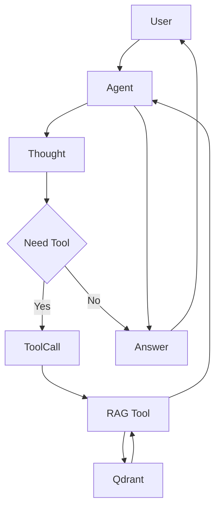

# ハイブリッド・ナレッジ・エージェント 仕様概要書

**プロジェクト名:** Gemini3 Hybrid RAG Agent
**最終更新日:** 2025/12/05
**バージョン:** 2.0 (Phase 2完了 / Phase 3計画策定)
**対象環境:** macOS (M2), Python 3.x, PyCharm, Qdrant (Local)

---

## 目次

1. [プロジェクト概要](#1-プロジェクト概要)
2. [システムアーキテクチャ](#2-システムアーキテクチャ)
3. [機能要件 (実装済み)](#3-機能要件-実装済み)
4. [構成定義](#4-構成定義)
5. [評価フレームワーク (Phase 3計画)](#5-評価フレームワーク-phase-3計画)
6. [エラーハンドリングと品質基準 (Phase 3計画)](#6-エラーハンドリングと品質基準-phase-3計画)
7. [開発ロードマップ](#7-開発ロードマップ)
8. [付録: 実装サンプル](#8-付録-実装サンプル)

---

## 1. プロジェクト概要

### 開発目的
既存のRAGシステム（知識検索）をAIエージェントの「道具（Tool）」として統合し、AIがユーザーの質問意図を自律的に解釈して「一般的な会話」と「専門知識の検索」を使い分ける **ReAct (Reasoning + Acting) 型エージェント** を構築する。さらに、本システムを評価用サンプルプログラムとして機能させ、定量的な精度測定を可能にする。

---

## 2. システムアーキテクチャ

本システムは、「脳（Gemini）」と「道具（RAG検索関数）」、そしてそれらを評価する「評価モジュール」で構成される。

- **Front-end:** Python CLI (Command Line Interface)
- **Brain (LLM):** Google Gemini 2.0 Flash (Manual Function Calling + System Instruction)
- **Knowledge Base:** Qdrant Vector Database
- **Embedding:** Gemini Embedding Model (text-embedding-004)

### 処理フロー図



---

## 3. 機能要件 (実装済み)

### 3.1. 対話機能 (Chat)
- **自然言語対話:** 文脈を保持したマルチターン会話。
- **ログ保存:** 全ての対話履歴（ユーザー入力、思考、行動、回答）を `logs/agent_chat.log` に自動保存。

### 3.2. 自律判断機能 (Router & CoT)
- **Router:** ユーザー入力に基づき、ツール使用の要否を自律的に判断。
  - *使用:* 仕様、設定、エラー、社内ドキュメントに関する質問。
  - *未使用:* 挨拶、一般常識、Python文法、雑談、計算。
- **CoT (Chain of Thought):** `[🧠 Thought]` として思考プロセスを可視化。
- **コレクション選択:** 質問内容に応じて適切なQdrantコレクション (`AgentConfig.RAG_AVAILABLE_COLLECTIONS`) を選択。不明な場合は `list_rag_collections` ツールを使用。

### 3.3. 情報検索機能 (RAG Tool)
- **ツール名:** `search_rag_knowledge_base`
- **入力:** クエリ, コレクション名（オプション）
- **処理:**
  1. クエリのベクトル化。
  2. 指定コレクション（またはデフォルト）を検索。
  3. **スコアフィルタリング:** 類似度スコアが閾値未満の結果を除外。
- **出力:** 整形済みテキスト、または「結果なし」メッセージ。
- **正直さ:** 検索結果がない場合、ハルシネーション（情報の捏造）を行わず、正直に「見つかりません」と回答。

### 3.4. 補助機能
- **ツール名:** `list_rag_collections`
- **機能:** 現在利用可能なQdrantコレクションの一覧とドキュメント数を返す。

---

## 4. 構成定義

### 4.1. ディレクトリ構成 (Phase 3 予定含む)

```
gemini3_rag_agent/
├── agent_main.py       # エージェント実行エントリーポイント
├── agent_tools.py      # ツール定義
├── config.py           # 設定管理 (AgentConfig, PathConfig)
├── agent_rag.py
├── logs/               # ログ出力先
├── ui/
├── eval/               # 【Phase 3 追加】評価モジュール
│   ├── __init__.py
│   ├── test_cases.json      # テストケース定義
│   ├── evaluator.py         # 自動評価ロジック
│   ├── metrics.py           # 評価指標計算
│   └── report_generator.py  # レポート生成
└── tests/              # 【Phase 3 追加】単体テスト
    ├── test_agent_tools.py
    └── test_routing.py
```

### 4.2. 環境変数 (.env)
- `GEMINI_API_KEY`: Gemini APIキー
- `QDRANT_HOST`: Qdrantホスト (default: localhost)
- `QDRANT_PORT`: Qdrantポート (default: 6333)

---

## 5. 評価フレームワーク (Phase 3計画)

定性的（使ってみて良さそう）な評価に加え、定量的（数値的）な評価を導入する。

### 5.1. 評価指標 (Metrics)

| 指標 | 説明 | 目標値 |
| :--- | :--- | :--- |
| **ルーティング精度** | ツール使用/未使用の判断が正しい割合 | ≥ 90% |
| **コレクション選択精度** | 適切なコレクションを選択した割合 | ≥ 85% |
| **検索精度 (Recall@3)** | 上位3件に正解が含まれる割合 | ≥ 80% |
| **ハルシネーション率** | 検索結果なしで回答を創作した割合 | 0% |
| **平均レイテンシ** | 検索実行時間 | ≤ 500ms |

### 5.2. 評価フロー
1. **テストケース定義 (`eval/test_cases.json`):**
   - 入力文、期待されるツール使用有無、期待されるコレクション名、期待される振る舞い（「見つからない」と答える等）を定義。
2. **自動実行 (`eval/evaluator.py`):**
   - 定義されたテストケースをエージェントに入力し、実際の挙動と比較。
3. **メトリクス収集:**
   - レイテンシ、スコア分布などを記録。
4. **レポート生成:**
   - 成功/失敗、精度、レイテンシ統計をJSONおよびコンソールに出力。

---

## 6. エラーハンドリングと品質基準 (Phase 3計画)

### 6.1. カスタム例外の導入
堅牢性を高めるため、以下の例外クラスを導入し、エラーの種類に応じた適切な処理を行う。
- `RAGToolError`: 基底クラス
- `QdrantConnectionError`: DB接続失敗
- `CollectionNotFoundError`: 指定コレクション不在
- `EmbeddingError`: ベクトル化失敗

### 6.2. メトリクス収集の実装
`agent_tools.py` に `SearchMetrics` クラスを導入し、検索ごとの詳細データ（クエリ、コレクション、レイテンシ、ヒット数、スコア分布）をメモリ上に保持、またはログ出力する仕組みを構築する。

---

## 7. 開発ロードマップ

### Phase 1 & 2: 基本機能実装 (完了)
- [x] ReAct型エージェントの構築
- [x] RAG検索ツールの実装
- [x] システムプロンプトによる制御
- [x] スコアフィルタリング
- [x] CoT可視化
- [x] ログ保存
- [x] 動的コレクション選択

### Phase 3: 評価と品質向上 (これから)
1. **評価フレームワーク構築 (優先度: 高)**
   - `eval/` ディレクトリ作成、評価スクリプト実装。
2. **テストケース作成 (優先度: 高)**
   - 20件以上の多様なテストケース（ルーティング、検索、ハルシネーション検証）を作成。
3. **品質向上 (優先度: 中)**
   - ロギングの統一 (`print`排除)、型ヒントの完備、カスタム例外の実装。
4. **CI/CD統合 (優先度: 中)**
   - GitHub Actions等での自動テスト・評価実行。

---

## 8. 付録: 実装サンプル

### Phase 2 最新実装 (agent_main.py 抜粋)
```python
# ReAct Loopの手動制御とロギング
while True:
    user_input = input("\nYou: ").strip()
    logger.info(f"User Input: {user_input}")

    # ... (モデル呼び出し) ...

    if part.text:
        if "Thought:" in part.text:
            print_colored(f"\n[🧠 Thought]\n{part.text}", "cyan")
            logger.info(f"Agent Thought: {part.text}")
        else:
            print(f"\nAgent: {part.text}")
            logger.info(f"Agent Response: {part.text}")
    
    if part.function_call:
        print_colored(f"[🛠️ Tool Call] {fn.name}({fn.args})", "yellow")
        logger.info(f"Agent Tool Call: {fn.name}({fn.args})")
        # ... (ツール実行)
```